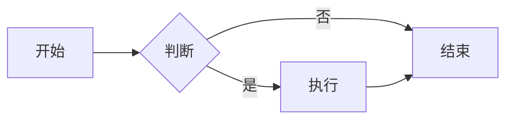

# Arch PPT - 现代化架构图演示平台

基于 Vite + Reveal.js + D3.js + Mermaid 的专业演示模板，专为软件架构师设计。

## ✨ 核心特性

- 📝 **Markdown 驱动** - 简单易用的内容编写体验
- 🎨 **D3 架构图** - 强大的自定义架构图渲染能力
- 🔗 **Mermaid 集成** - 快速绘制流程图、序列图等
- ⚡ **实时预览** - Vite 驱动的热重载开发体验
- 🎯 **智能错误处理** - 友好的错误提示和自动恢复
- 🖼️ **统一图片渲染** - 自动优化的图片显示效果
- 🎛️ **可选 Tailwind** - 灵活的样式定制方案
- 📱 **响应式设计** - 完美适配各种设备和屏幕

## 🚀 快速开始

```bash
# 安装依赖
npm install

# 启动开发服务器
npm run dev

# 构建生产版本
npm run build

# 预览构建结果
npm run preview
```

启动后访问 http://localhost:5173 查看演示。

## 📁 项目结构

```
project/
├── slides/                 # Markdown 幻灯片文件
│   └── demo.md             # 功能演示文档
├── src/
│   ├── main.ts             # 应用入口
│   ├── lib/
│   │   ├── d3/             # D3 图表系统
│   │   │   ├── index.ts    # 主入口和类型定义
│   │   │   └── charts/     # 图表渲染器
│   │   │       ├── architecture.ts  # 架构图渲染器
│   │   │       ├── bar.ts           # 条形图
│   │   │       └── line.ts          # 折线图
│   │   ├── markdown/       # Markdown 处理
│   │   │   ├── splitter.ts # 分片处理
│   │   │   └── image.ts    # 图片渲染器
│   │   └── highlight.ts    # 代码高亮
│   └── styles/
│       ├── theme.css       # 主题样式
│       ├── mermaid.css     # Mermaid 样式
│       └── tailwind.css    # Tailwind 样式（可选）
├── public/
│   └── assets/             # 静态资源
│       └── diagram.svg     # 示例图片
└── README.md
```

## 📝 Markdown 使用指南

### 基础语法

```markdown
# 主标题

## 二级标题

- 列表项目
- **粗体** 和 *斜体*
- `代码片段`

---
# 新的幻灯片页面

--
## 垂直子页面（使用 -- 分隔符）
```

### 分片规则

- `---` - 创建水平分片（新的主页面）
- `--` - 创建垂直分片（当前页面的子页面）

## 🎨 D3 架构图使用

### 基础架构图

使用 `d3-arch` 代码块创建架构图：

```markdown
```d3-arch
{
  "layout": { "type": "dag", "rankdir": "LR" },
  "nodes": [
    { "id": "client", "label": "客户端", "type": "gateway" },
    { "id": "api", "label": "API服务", "type": "service" },
    { "id": "db", "label": "数据库", "type": "database" }
  ],
  "edges": [
    { "source": "client", "target": "api" },
    { "source": "api", "target": "db", "directed": true }
  ]
}
```
```

### 节点类型

- `gateway` - 网关/入口（黄色）
- `service` - 服务（蓝色）
- `database` - 数据库（绿色）
- `queue` - 消息队列（粉色）

### 边样式

- `straight` - 直线连接（默认）
- `curved` - 曲线连接
- `orthogonal` - 直角连接

### 布局选项

```json
{
  "layout": {
    "type": "dag",           // dag | force | grid | manual
    "rankdir": "LR",         // LR (左到右) | TB (上到下)
    "nodeGap": 120,          // 节点间距
    "levelGap": 160          // 层级间距
  }
}
```

### 交互配置

```json
{
  "interactions": {
    "zoom": true,                    // 缩放功能
    "drag": true,                    // 拖拽功能
    "highlightPathOnHover": true     // 鼠标悬停高亮
  }
}
```

## 🖼️ 图片使用

### 相对路径引用

```markdown

```

图片会自动应用统一样式：
- 响应式缩放
- 圆角边框
- 阴影效果
- 悬停动画

### 支持格式

- SVG（推荐用于图表）
- PNG、JPG（通用图片）
- WebP（现代浏览器优化）

## 🔗 Mermaid 图表

```markdown

```

支持的图表类型：
- 流程图 (`flowchart`)
- 序列图 (`sequenceDiagram`)
- 甘特图 (`gantt`)
- 类图 (`classDiagram`)
- 状态图 (`stateDiagram`)

## 🎨 Tailwind CSS（可选）

### 启用 Tailwind

在 `src/main.ts` 中取消注释：

```typescript
import './styles/tailwind.css';
```

然后安装依赖：

```bash
npm install -D tailwindcss @tailwindcss/typography
```

### 使用 Tailwind

所有类名使用 `tw-` 前缀：

```markdown
<div class="tw-bg-blue-500 tw-text-white tw-p-4 tw-rounded-lg">
  自定义样式内容
</div>
```

### Typography 插件

```markdown
<div class="tw-prose tw-prose-invert">
  # 这里的内容会应用 Typography 样式
  
  包括优化的段落间距、列表样式等。
</div>
```

## ⚡ 性能优化

### 懒加载

- D3 图表按需动态导入
- Mermaid 仅在需要时加载
- 图片采用原生懒加载

### 智能渲染

- 避免重复渲染已处理的元素
- 幻灯片切换时使用节流机制
- 错误隔离，单个组件错误不影响整体

### 缓存机制

- 使用 WeakSet 追踪已渲染元素
- 避免重复处理相同内容

## 🔧 配置选项

### Reveal.js 配置

在 `src/main.ts` 中修改 Reveal 初始化选项：

```typescript
const deck = new Reveal({
  hash: true,
  controls: true,
  progress: true,
  center: true,
  transition: 'slide',    // slide | fade | none | zoom
  viewDistance: 3,        // 预加载距离
  // 更多选项...
});
```

### Mermaid 配置

```typescript
mermaid.initialize({ 
  startOnLoad: false,
  theme: 'dark',          // dark | light | neutral
  themeVariables: {
    darkMode: true
  }
});
```

## 🎯 错误处理

### 友好的错误提示

- Markdown 文件加载失败
- JSON 配置解析错误
- D3 渲染异常
- 网络连接问题

### 自动恢复

- 单个组件错误不影响其他内容
- 提供详细的错误信息和解决建议
- 支持重新加载恢复

## 📱 响应式支持

### 移动设备

- 触摸手势导航
- 优化的移动端布局
- 适配小屏幕的图表尺寸

### 桌面设备

- 键盘快捷键支持
- 鼠标交互优化
- 多显示器支持

## ⌨️ 键盘快捷键

- `→` / `Space` - 下一页
- `←` / `Shift+Space` - 上一页
- `↓` - 向下导航
- `↑` - 向上导航
- `ESC` - 概览模式
- `S` - 演讲者模式
- `F` - 全屏模式
- `Ctrl+R` - 重新加载

## 🔍 调试指南

### 开发者工具

1. 打开浏览器开发者工具
2. 查看 Console 面板获取错误信息
3. 使用 Network 面板检查资源加载

### 常见问题

**Q: Markdown 文件加载失败**
A: 检查文件路径和 URL 参数 `?src=` 是否正确

**Q: D3 图表不显示**
A: 检查 JSON 配置格式，确保 `nodes` 和 `edges` 数组正确

**Q: Mermaid 图表渲染异常**
A: 检查语法是否符合 Mermaid 规范

**Q: 样式冲突**
A: 检查是否正确使用 `tw-` 前缀（Tailwind）或 CSS 作用域

## 🚀 部署指南

### 静态部署

```bash
# 构建生产版本
npm run build

# 部署 dist/ 目录到任何静态服务器
```

### 支持的平台

- GitHub Pages
- Netlify
- Vercel
- 阿里云 OSS
- 腾讯云 COS
- 自建 Nginx/Apache

### 配置示例

**Nginx 配置**
```nginx
server {
    listen 80;
    server_name your-domain.com;
    root /path/to/dist;
    index index.html;
    
    location / {
        try_files $uri $uri/ /index.html;
    }
}
```

## 📄 许可证

MIT License - 详见 [LICENSE](LICENSE) 文件

## 🤝 贡献指南

欢迎提交 Issue 和 Pull Request！

1. Fork 本仓库
2. 创建特性分支
3. 提交更改
4. 推送到分支
5. 创建 Pull Request

## 📚 更多资源

- [Reveal.js 官方文档](https://revealjs.com/)
- [D3.js 官方文档](https://d3js.org/)
- [Mermaid 官方文档](https://mermaid.js.org/)
- [Tailwind CSS 文档](https://tailwindcss.com/)

---

**开始创建你的专业架构演示吧！** 🎉