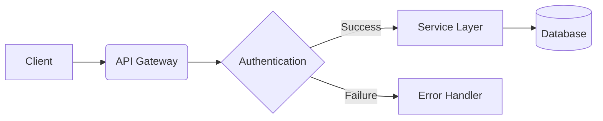
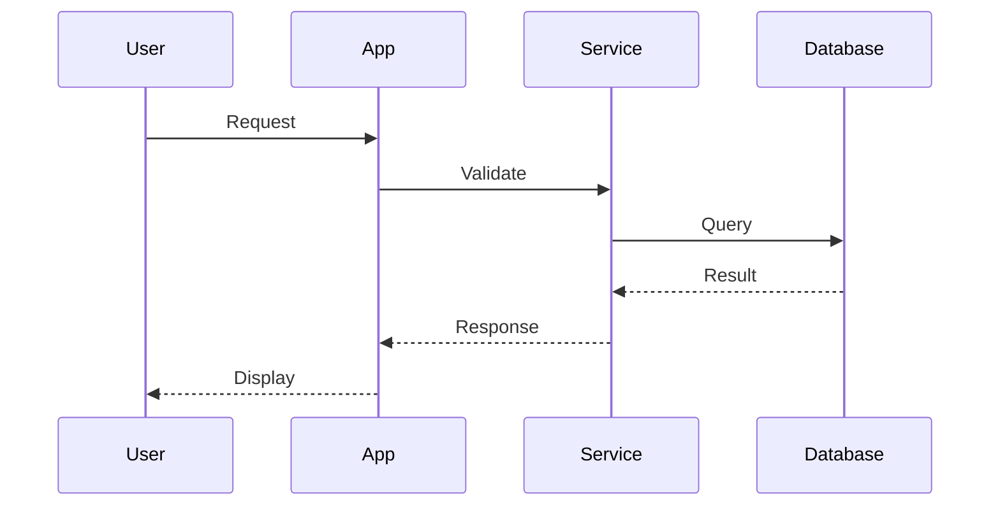

# Arch PPT 功能演示
现代化的架构图演示平台

---

## 核心特性
- 📝 **Markdown 驱动** - 简单易用的内容编写
- 🎨 **D3 架构图** - 强大的自定义图表能力  
- 🔗 **Mermaid 集成** - 快速绘制流程图
- ⚡ **实时预览** - Vite 驱动的热重载
- 🎯 **错误处理** - 友好的错误提示和恢复

---

## Markdown 基础语法

### 文本格式
- **粗体文本**
- *斜体文本*
- `代码片段`
- ~~删除线~~

### 列表
1. 有序列表项目 1
2. 有序列表项目 2
   - 嵌套无序列表
   - 另一个嵌套项目

--

### 水平分片示例
这是同一页面的垂直子页面，使用 `--` 分隔符创建。

可以通过向下箭头键或向下滑动来访问。

---

## 图片渲染（统一风格）
使用相对路径引用图片，自动应用一致的样式：


图片特性：
- 自动响应式缩放
- 统一的圆角和阴影
- 悬停交互效果
- 支持各种格式（SVG、PNG、JPG）

---

## Mermaid 图表集成

### 流程图示例


### 序列图示例


---

## D3 架构图（高级功能）

### 基础架构图
```d3-arch
{
  "layout": { "type": "dag", "rankdir": "LR", "nodeGap": 120, "levelGap": 160 },
  "nodes": [
    { "id": "client", "label": "Client App", "type": "gateway" },
    { "id": "gw", "label": "API Gateway", "type": "gateway" },
    { "id": "auth", "label": "Auth Service", "type": "service" },
    { "id": "user", "label": "User Service", "type": "service" },
    { "id": "order", "label": "Order Service", "type": "service" },
    { "id": "db", "label": "PostgreSQL", "type": "database" },
    { "id": "cache", "label": "Redis", "type": "database" }
  ],
  "edges": [
    { "source": "client", "target": "gw", "style": "straight" },
    { "source": "gw", "target": "auth", "style": "curved" },
    { "source": "gw", "target": "user", "style": "curved" },
    { "source": "gw", "target": "order", "style": "curved" },
    { "source": "user", "target": "db", "directed": true },
    { "source": "order", "target": "db", "directed": true },
    { "source": "auth", "target": "cache", "directed": true, "style": "orthogonal" }
  ],
  "interactions": { "zoom": true, "drag": true, "highlightPathOnHover": true }
}
```

---

## 复杂架构图示例

### 微服务架构
```d3-arch
{
  "width": 1000,
  "height": 600,
  "layout": { "type": "dag", "rankdir": "TB", "nodeGap": 100, "levelGap": 100 },
  "nodes": [
    { "id": "lb", "label": "Load Balancer", "type": "gateway" },
    { "id": "api1", "label": "API Server 1", "type": "service" },
    { "id": "api2", "label": "API Server 2", "type": "service" },
    { "id": "auth", "label": "Auth Service", "type": "service" },
    { "id": "user", "label": "User Service", "type": "service" },
    { "id": "payment", "label": "Payment Service", "type": "service" },
    { "id": "notification", "label": "Notification", "type": "service" },
    { "id": "mysql", "label": "MySQL", "type": "database" },
    { "id": "redis", "label": "Redis Cache", "type": "database" },
    { "id": "mq", "label": "Message Queue", "type": "queue" }
  ],
  "edges": [
    { "source": "lb", "target": "api1" },
    { "source": "lb", "target": "api2" },
    { "source": "api1", "target": "auth" },
    { "source": "api2", "target": "auth" },
    { "source": "api1", "target": "user" },
    { "source": "api2", "target": "user" },
    { "source": "api1", "target": "payment" },
    { "source": "user", "target": "mysql", "directed": true },
    { "source": "payment", "target": "mysql", "directed": true },
    { "source": "auth", "target": "redis", "directed": true },
    { "source": "payment", "target": "mq", "directed": true, "style": "curved" },
    { "source": "mq", "target": "notification", "directed": true, "style": "curved" }
  ]
}
```

---

## 代码高亮示例

### TypeScript
```ts
interface User {
  id: string;
  name: string;
  email: string;
  createdAt: Date;
}

class UserService {
  async createUser(userData: Partial<User>): Promise<User> {
    const user: User = {
      id: generateId(),
      ...userData,
      createdAt: new Date()
    };
    
    await this.database.save(user);
    return user;
  }
}
```

### Python
```python
from typing import Optional, List
from dataclasses import dataclass
from datetime import datetime

@dataclass
class User:
    id: str
    name: str
    email: str
    created_at: datetime

class UserService:
    def __init__(self, database):
        self.database = database
    
    async def create_user(self, user_data: dict) -> User:
        user = User(
            id=generate_id(),
            **user_data,
            created_at=datetime.now()
        )
        
        await self.database.save(user)
        return user
```

---

## D3 图表示例

### 条形图
<div data-d3="bar" data-config='{"data":[12,19,3,5,2,3,15,8,13,21],"width":640,"height":320}'></div>

### 折线图  
<div data-d3="line" data-config='{"data":[{"x":0,"y":10},{"x":1,"y":15},{"x":2,"y":8},{"x":3,"y":20},{"x":4,"y":12},{"x":5,"y":25}],"width":640,"height":320}'></div>

---

## 错误处理演示

### 正常的架构图
```d3-arch
{
  "nodes": [{"id": "a", "label": "Node A"}, {"id": "b", "label": "Node B"}],
  "edges": [{"source": "a", "target": "b"}]
}
```

### 故意的错误示例（会显示友好错误信息）
```d3-arch
{
  "nodes": [],
  "edges": [{"source": "nonexistent", "target": "also_nonexistent"}]
}
```

---

## 响应式设计

这个演示平台支持：

- 📱 **移动设备优化** - 触摸手势和响应式布局
- 🖥️ **桌面体验** - 键盘快捷键和鼠标交互  
- 🖨️ **打印友好** - 优化的打印样式
- ♿ **无障碍支持** - 屏幕阅读器兼容

---

## 键盘快捷键

- `→` / `↓` - 下一页/下一节
- `←` / `↑` - 上一页/上一节  
- `ESC` - 概览模式
- `S` - 演讲者模式
- `F` - 全屏模式
- `Ctrl+R` - 重新加载

---

## 性能特性

- ⚡ **懒加载** - 按需加载 D3 和 Mermaid
- 🚀 **节流优化** - 智能的重渲染控制
- 💾 **缓存机制** - 避免重复渲染
- 📦 **Tree Shaking** - 仅打包使用的功能

---

## 技术栈

| 技术 | 用途 | 版本 |
|------|------|------|
| Reveal.js | 演示框架 | ^5.1.0 |
| D3.js | 数据可视化 | ^7.9.0 |
| Mermaid | 图表渲染 | ^10.9.1 |
| Vite | 构建工具 | ^5.4.6 |
| TypeScript | 类型安全 | ^5.6.2 |

---

## 感谢使用 Arch PPT! 🎉

更多功能正在开发中...

- 🔄 更多 D3 图表类型
- 🎨 主题定制系统  
- 📊 数据绑定支持
- 🔌 插件生态

**开始创建你的架构演示吧！**