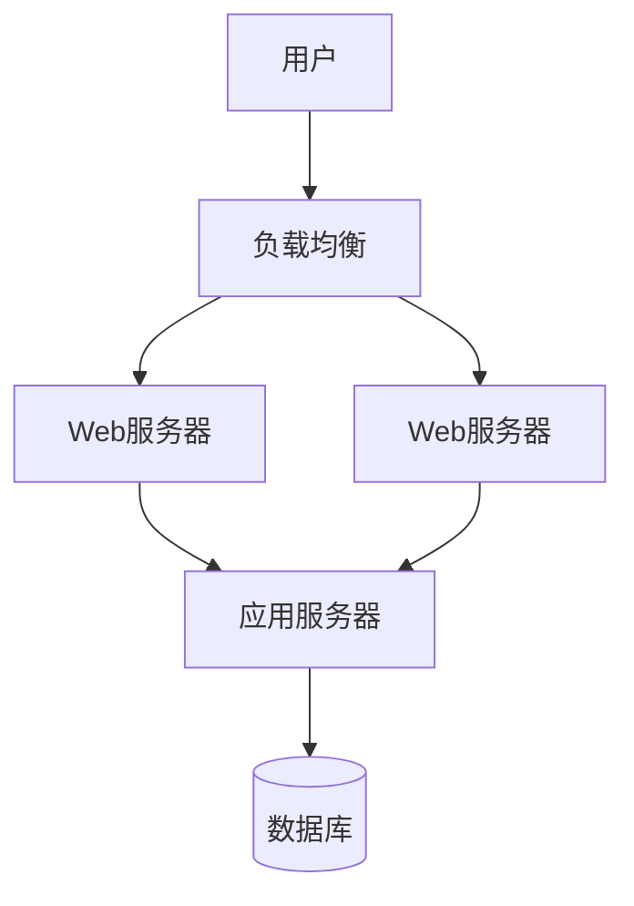

# Arch PPT - 专业架构演示平台

基于 Reveal.js + Markdown 的架构演示工具，专为软件架构师设计的 PPT 制作平台。

## ✨ 核心特性

- 📝 **Markdown 驱动 PPT** - 用熟悉的 Markdown 语法快速制作专业演示
- 🏗️ **架构图专家** - 内置 Mermaid，轻松绘制各种架构图表
- 🌐 **HTML/CSS/JS 完全支持** - 直接嵌入HTML、CSS样式和JavaScript交互
- 🎬 **丰富动画效果** - CSS动画、JavaScript动画、SVG动画等
- 🖼️ **多媒体集成** - 图片、视频、音频等媒体内容无缝支持
- ⚡ **实时预览** - Vite 驱动的热重载，编辑即刻看到效果
- 🎨 **专业演示** - Reveal.js 提供的丰富过渡动画和演讲者模式
- 📱 **全平台适配** - 支持桌面、移动端、投影仪等各种展示场景
- 🔧 **可选增强** - 可集成 Tailwind CSS 和 D3.js 扩展功能

## 🚀 快速开始

```bash
# 安装依赖
npm install

# 启动开发服务器
npm run dev

# 构建演示文件
npm run build
```

启动后访问 http://localhost:5173 查看演示效果。

## 📁 项目结构

```
project/
├── slides/                 # PPT 内容（文件夹模式）
│   ├── 01/                 # 第1页
│   │   ├── index.md        # 主内容
│   │   ├── sub-1.md        # 子页面1
│   │   └── images/         # 页面相关图片
│   ├── 02/                 # 第2页
│   │   └── index.md        # 主内容
│   └── ...
├── src/                    # 核心代码
│   ├── main.ts             # 应用入口
│   ├── lib/                # 核心功能库
│   └── styles/             # 样式文件
├── public/
│   └── assets/             # 全局静态资源
└── README.md
```

## 📝 制作 PPT 演示

### 文件夹组织方式

每一页 PPT 对应一个文件夹，便于管理和扩展：

```
slides/
├── index.json          # 控制页面顺序的配置文件
├── intro/              # 项目介绍
│   ├── index.md        # 主要内容
│   ├── sub-1.md        # 子页面：详细说明
│   └── logo.png        # 页面相关图片
├── architecture/       # 架构设计
│   ├── index.md        # 架构图和说明
│   └── arch-diagram.svg
├── interactive/        # 交互式组件演示
│   ├── index.md        # HTML+CSS+JS示例
│   └── sub-1.md        # 动画效果演示
├── multimedia/         # 多媒体展示
│   └── index.md        # 图片、视频等媒体内容
├── html-demo/          # HTML页面演示
│   ├── index.html      # 完整的HTML演示页面
│   └── sub-1.html      # Canvas动画子页面
├── fragments/          # 分步显示演示
│   ├── index.md        # Fragment基础用法
│   ├── sub-1.md        # 高级Fragment技巧
│   └── sub-2.html      # HTML版Fragment演示
├── pure-html/          # 纯HTML幻灯片文件夹
│   ├── index.html      # 主页面（交互演示）
│   ├── sub-1.html      # 数据可视化页面
│   ├── styles.css      # 样式文件
│   ├── script.js       # 脚本文件
│   └── assets/         # 资源文件夹
├── system-design/      # 级联文件夹演示
│   ├── index.md        # 主题概览
│   ├── architecture-principles.md    # 架构原则
│   ├── data-modeling.md              # 数据建模
│   ├── performance-optimization.html # 性能优化(HTML)
│   ├── security-design.md            # 安全设计
│   └── frontend-architecture.md      # 前端架构
├── deployment/         # 部署方案
│   └── index.md
└── summary/            # 项目总结
    └── index.md
```

### 文件命名规则

- **主页面**: `index.md` 或 `index.html` - 每个文件夹的主要内容
- **子页面**: `sub-1.md`/`sub-1.html`, `sub-2.md`/`sub-2.html` - 垂直导航的详细内容  
- **图片**: 直接放在同一文件夹内，使用相对路径引用
- **HTML优先**: 如果同时存在`.md`和`.html`文件，优先加载HTML文件

### 内容编写

#### Markdown 基础语法

```markdown
# 标题
## 子标题

**粗体** *斜体*

- 列表项 1
- 列表项 2

[链接](https://example.com)

```

#### 分页语法

```markdown
# 第一页
内容...

---
# 第二页 (水平分页)
内容...

--
## 第二页的子页面 (垂直分页)
详细内容...
```

#### HTML + CSS + JavaScript 支持

你可以在 Markdown 中直接嵌入 HTML、CSS 和 JavaScript：

```html
<!-- HTML 样式 -->
<div style="background: linear-gradient(45deg, #667eea, #764ba2); padding: 20px; color: white;">
  <h3>渐变背景标题</h3>
  <p>这是使用内嵌CSS的HTML内容</p>
</div>

<!-- CSS 动画 -->
<style>
  .pulse {
    animation: pulse 2s infinite;
  }
  @keyframes pulse {
    0% { transform: scale(1); }
    50% { transform: scale(1.1); }
    100% { transform: scale(1); }
  }
</style>

<div class="pulse">动画元素</div>

<!-- JavaScript 交互 -->
<button onclick="alert('Hello!')">点击我</button>

<script>
  // 你的 JavaScript 代码
  console.log('页面加载完成');
</script>
```

#### 图片展示

```markdown
<!-- 基础图片 -->


<!-- 带样式的图片 -->


<!-- 响应式图片 -->
<div style="text-align: center;">
  
</div>
```

#### 动画效果

支持 CSS 动画和 JavaScript 动画：

```css
/* CSS 动画示例 */
.slide-in {
  animation: slideIn 1s ease-out;
}

@keyframes slideIn {
  from { transform: translateX(-100%); }
  to { transform: translateX(0); }
}
```

```javascript
// JavaScript 动画示例
const element = document.getElementById('myElement');
element.style.transition = 'all 0.5s ease';
element.style.transform = 'scale(1.2)';
```

#### 独立HTML文件

对于复杂的交互内容，建议使用独立的HTML文件：

**HTML文件夹结构示例:**
```
slides/
└── my-interactive-demo/
    ├── index.html          # 主页面（完整的HTML文档）
    ├── sub-1.html          # 子页面
    ├── styles.css          # 外部CSS样式表
    ├── script.js           # 外部JavaScript文件
    ├── demo-image.jpg      # 图片资源
    ├── fonts/              # 字体文件夹
    │   └── custom-font.woff2
    └── data/               # 数据文件夹
        ├── config.json
        └── sample-data.csv
```

**HTML文件夹渲染特性:**
- ✅ **智能内容提取**: 自动提取`<body>`内容和`<head>`中的`<style>`、`<script>`标签
- ✅ **相对路径处理**: 自动解析和修正所有相对路径资源引用
- ✅ **外部资源支持**: CSS文件、JS文件、图片、字体等外部资源
- ✅ **完整HTML5支持**: Canvas、SVG、Web API、localStorage等现代特性
- ✅ **样式隔离**: HTML内容不会与Reveal.js主题冲突
- ✅ **脚本执行**: 支持内联和外部JavaScript代码执行
- ✅ **响应式设计**: 适配不同屏幕尺寸的演示设备

**示例HTML文件:**
```html
<!DOCTYPE html>
<html lang="zh-CN">
<head>
    <meta charset="UTF-8">
    <title>我的演示页面</title>
    <style>
        .demo-container {
            padding: 20px;
            font-family: 'Segoe UI', sans-serif;
        }
        .interactive-element {
            transition: all 0.3s ease;
        }
    </style>
</head>
<body>
    <div class="demo-container">
        <h1>交互式演示</h1>
        <button onclick="handleClick()">点击我</button>
        <canvas id="myCanvas" width="400" height="300"></canvas>
    </div>
    
    <script>
        function handleClick() {
            // 你的交互逻辑
        }
        
        // Canvas绘制
        const canvas = document.getElementById('myCanvas');
        const ctx = canvas.getContext('2d');
        // 绘制代码...
    </script>
</body>
</html>
```

**资源引用处理:**
```html
<!-- 相对路径资源会自动转换 -->
<link rel="stylesheet" href="styles.css">          <!-- → slides/folder/styles.css -->
<script src="script.js"></script>                  <!-- → slides/folder/script.js -->
                   <!-- → slides/folder/image.jpg -->

<!-- CSS中的资源引用也会处理 -->
<style>
.bg { background-image: url('bg.jpg'); }           /* → slides/folder/bg.jpg */
</style>
```

**加载顺序和优先级:**
1. **优先级**: `index.html` > `index.md`（HTML文件优先）
2. **内容提取**: 完整HTML文档会自动提取`<body>`内容
3. **样式合并**: `<head>`中的`<style>`标签会被保留
4. **脚本执行**: 内联和外部JavaScript都会正常执行
5. **错误处理**: 资源加载失败不会影响整个演示

**技术实现细节:**
- 使用正则表达式智能识别和替换相对路径
- 支持各种资源类型：图片、CSS、JS、字体、数据文件等
- 自动处理`src`、`href`、`url()`等不同的引用方式
- 保持HTML语义结构和可访问性

**HTML文件夹组织:**

对于复杂的HTML项目，建议按如下方式组织文件夹：

```
slides/my-html-demo/
├── index.html          # 主页面
├── sub-1.html          # 子页面
├── styles.css          # 样式文件
├── script.js           # 脚本文件
├── data.json           # 数据文件
└── assets/             # 资源文件夹
    ├── images/
    ├── fonts/
    └── icons/
```

**HTML文件处理机制:**
- 系统自动提取HTML文档的`<body>`内容
- 自动提取`<head>`中的`<style>`标签
- 自动提取所有`<script>`标签
- 自动处理相对路径资源引用（图片、CSS、JS等）
- 避免HTML文档结构与Reveal.js冲突

**最佳实践:**
- 使用语义化的HTML结构
- CSS使用相对单位适配不同屏幕
- JavaScript事件绑定使用标准DOM API
- 避免与Reveal.js的快捷键冲突（ESC、F、S等）
- 为复杂动画使用`requestAnimationFrame`
- 将样式和脚本分离到独立文件
- 使用`assets/`文件夹管理资源文件
- 大型资源文件建议使用外部CDN
- 测试不同浏览器的兼容性

#### Fragment 分步显示

在单个幻灯片中实现内容的分步显示，类似PowerPoint的动画效果：

**基础用法:**
```html
<p class="fragment">第一步显示的内容</p>
<p class="fragment">第二步显示的内容</p>
<p class="fragment">第三步显示的内容</p>
```

**动画效果:**
```html
<p class="fragment fade-in">渐入效果</p>
<p class="fragment fade-out">渐出效果</p>
<p class="fragment fade-up">从下往上</p>
<p class="fragment fade-down">从上往下</p>
<p class="fragment fade-left">从右往左</p>
<p class="fragment fade-right">从左往右</p>
<p class="fragment fade-in-then-out">先显示后隐藏</p>
<p class="fragment fade-in-then-semi-out">先显示后半透明</p>
```

**高亮效果:**
```html
<span class="fragment highlight-red">红色高亮</span>
<span class="fragment highlight-blue">蓝色高亮</span>
<span class="fragment highlight-green">绿色高亮</span>
<span class="fragment highlight-current-red">当前红色高亮</span>
```

**自定义顺序:**
```html
<p class="fragment" data-fragment-index="3">第四个显示</p>
<p class="fragment" data-fragment-index="1">第二个显示</p>
<p class="fragment" data-fragment-index="2">第三个显示</p>
<p class="fragment" data-fragment-index="0">第一个显示</p>
```

**代码块分步展示:**
```markdown
# 初始代码
```python
def hello():
    pass
```

<div class="fragment">

# 添加功能
```python
def hello():
    print("Hello, World!")
```

</div>
```

**列表项逐一显示:**
```html
<ul>
<li class="fragment">第一个项目</li>
<li class="fragment">第二个项目</li>
<li class="fragment">第三个项目</li>
</ul>
```

**操作说明:**
- **前进:** 空格键、方向键右/下、鼠标点击
- **后退:** Shift+空格、方向键左/上
- **跳过Fragment:** Page Down/Page Up
- **演讲者模式:** 按'S'键可看到当前和下一个Fragment

**注意事项:**
- Fragment只在水平切换时生效，垂直切换会跳过所有Fragment
- 可以嵌套使用Fragment实现复杂的显示逻辑
- 结合CSS动画可以实现更丰富的效果
- HTML文件中可以监听`fragmentshown`和`fragmenthidden`事件

### PPT 顺序管理

通过 `slides/index.json` 配置文件控制页面顺序：

#### 基础配置

```json
{
  "title": "我的架构演示",
  "author": "架构师",
  "slides": [
    {"id": "intro", "title": "项目介绍", "folder": "intro"},
    {"id": "arch", "title": "系统架构", "folder": "architecture"},
    {"id": "deploy", "title": "部署方案", "folder": "deployment"}
  ]
}
```

#### 级联子页面配置

对于同一主题下的多个相关slides，可以使用级联结构：

```json
{
  "title": "系统设计专题",
  "author": "架构师",
  "slides": [
    {
      "id": "system-design",
      "title": "系统设计专题",
      "folder": "system-design",
      "subSlides": [
        {
          "id": "architecture-principles",
          "title": "架构设计原则",
          "file": "architecture-principles.md"
        },
        {
          "id": "data-modeling",
          "title": "数据建模设计", 
          "file": "data-modeling.md"
        },
        {
          "id": "performance-optimization",
          "title": "性能优化策略",
          "file": "performance-optimization.html"
        }
      ]
    }
  ]
}
```

#### 级联结构特性

**文件夹组织方式**:
```
slides/system-design/
├── index.md                    # 主题概览页面
├── architecture-principles.md  # 子页面1
├── data-modeling.md            # 子页面2  
├── performance-optimization.html # 子页面3 (HTML格式)
├── security-design.md          # 子页面4
└── frontend-architecture.md    # 子页面5
```

**导航结构**:
- **水平导航**: 在不同主题间切换
- **垂直导航**: 在同一主题的子页面间切换
- **自动排序**: 按配置文件中的subSlides顺序加载
- **混合格式**: 支持.md和.html文件混合使用

**优势**:
- ✅ **主题聚焦**: 相关内容集中管理
- ✅ **导航清晰**: 层次结构明确
- ✅ **维护方便**: 主题相关文件在同一文件夹
- ✅ **灵活排序**: 通过配置文件控制顺序
- ✅ **格式自由**: 支持Markdown和HTML混合

**调整顺序**：只需在配置文件中调整数组顺序，无需重命名文件夹！

```json
// 想把部署方案提前？只需调整配置：
{
  "slides": [
    {"id": "intro", "title": "项目介绍", "folder": "intro"},
    {"id": "deploy", "title": "部署方案", "folder": "deployment"},  // 提前
    {"id": "arch", "title": "系统架构", "folder": "architecture"}
  ]
}
```

### 内容编写

在 `intro/index.md` 中编写：
```markdown
# 项目介绍
这是项目介绍页的主要内容


```

在 `intro/sub-1.md` 中编写子页面：
```markdown
## 详细说明
这里是项目介绍页的子页面，通过向下导航访问
```

## 🏗️ 架构图绘制

### Mermaid 图表（主要）

最常用的架构图表工具：

```markdown
## 系统架构图


```

### 支持的图表类型

- **流程图** (`flowchart`) - 系统架构、业务流程
- **序列图** (`sequenceDiagram`) - 接口调用、时序关系  
- **类图** (`classDiagram`) - 代码结构、模块关系
- **状态图** (`stateDiagram`) - 状态转换、生命周期
- **甘特图** (`gantt`) - 项目进度、里程碑规划

### 架构图最佳实践

1. **保持简洁** - 一页一个主要概念
2. **层次清晰** - 从宏观到微观逐步展开
3. **标注说明** - 关键组件添加文字说明
4. **统一风格** - 使用一致的图表样式

## 🖼️ 图片和资源

### 图片使用

**推荐方式**：图片放在对应页面文件夹内
```markdown
# 在 slides/02/index.md 中

```

**全局图片**：放在 `public/assets/` 目录
```markdown

```

### 支持格式

- **SVG** - 推荐用于架构图和矢量图
- **PNG/JPG** - 通用图片格式
- **WebP** - 现代浏览器优化格式

## 🎨 代码展示

### 语法高亮

支持多种编程语言的代码高亮：

```markdown
```javascript
// JavaScript 示例
const express = require('express');
const app = express();

app.get('/api/users', (req, res) => {
  res.json({ users: [] });
});
```

```java  
// Java 示例
public class UserService {
    public List<User> getUsers() {
        return userRepository.findAll();
    }
}
```
```

## 🎛️ 演示控制

### 键盘快捷键

- `→` / `Space` - 下一页
- `←` / `Shift+Space` - 上一页  
- `↓` - 向下翻页（垂直子页面）
- `↑` - 向上翻页
- `ESC` - 演示概览
- `S` - 演讲者模式
- `F` - 全屏模式

### 演讲者功能

- **演讲者备注** - 仅演讲者可见的提示内容
- **时间控制** - 演示计时和进度追踪
- **双屏显示** - 演讲者屏幕和观众屏幕分离

## 🎨 样式定制（可选）

### Tailwind CSS

如需更丰富的样式控制，可启用 Tailwind：

```typescript
// 在 src/main.ts 中取消注释
import './styles/tailwind.css';
```

然后安装依赖：

```bash
npm install -D tailwindcss @tailwindcss/typography
```

### 自定义主题

修改 `src/styles/theme.css` 文件自定义样式：

```css
/* 自定义颜色 */
.reveal h1 { color: #your-color; }

/* 自定义字体 */
.reveal { font-family: 'Your-Font', sans-serif; }
```

## 🔧 高级功能

### D3.js 图表（可选）

对于需要复杂交互的架构图，可使用 D3：

```markdown
<div data-d3="arch" data-config='{"nodes":[...],"edges":[...]}'></div>
```

**注意**: D3 仅作为 Mermaid 的补充工具，日常使用推荐 Mermaid。

### 配置选项

在 `src/main.ts` 中调整 Reveal.js 配置：

```typescript
const deck = new Reveal({
  controls: true,          // 显示控制按钮
  progress: true,          // 显示进度条
  center: true,            // 垂直居中
  transition: 'slide'      // 切换动画
});
```

## 📱 多设备支持

### 响应式设计

- **桌面演示** - 大屏投影、会议室展示
- **移动查看** - 手机、平板浏览和分享
- **打印输出** - PDF 导出和纸质打印

### 触控支持

- **手势导航** - 滑动切换页面
- **触摸友好** - 大按钮、易点击的交互元素

## 🚀 部署发布

### 构建命令

```bash
# 生产构建
npm run build

# 预览构建结果  
npm run preview
```

### 部署选项

- **GitHub Pages** - 免费的静态站点托管
- **Netlify/Vercel** - 现代化部署平台
- **企业内网** - Nginx/Apache 静态文件服务
- **CDN** - 阿里云 OSS、腾讯云 COS 等

## 💡 使用技巧

### 架构演示建议

1. **开场** - 项目背景和目标
2. **概览** - 整体架构鸟瞰图
3. **分层** - 逐层深入技术细节
4. **关键点** - 重点技术决策说明
5. **总结** - 架构优势和后续规划

### 内容组织

- **一页一概念** - 避免信息过载
- **渐进展示** - 利用垂直分页展开细节
- **视觉引导** - 用图表和动画引导注意力

## 🛠️ 故障排除

### 常见问题

**Q: 页面显示空白**  
A: 检查 Markdown 文件路径，确保 `slides/demo.md` 存在

**Q: 图片不显示**  
A: 确保图片放在 `public/assets/` 目录，使用 `assets/image.png` 路径

**Q: Mermaid 图表不渲染**  
A: 检查语法是否正确，参考 [Mermaid 官方文档](https://mermaid.js.org/)

## 📄 许可证

MIT License

## 🤝 贡献指南

欢迎提交 Issue 和 Pull Request 改进项目！

---

**开始制作你的专业架构演示吧！** 🎯

这是一个专注于 **PPT 制作** 和 **架构图展示** 的工具，让复杂的技术方案变得清晰易懂。