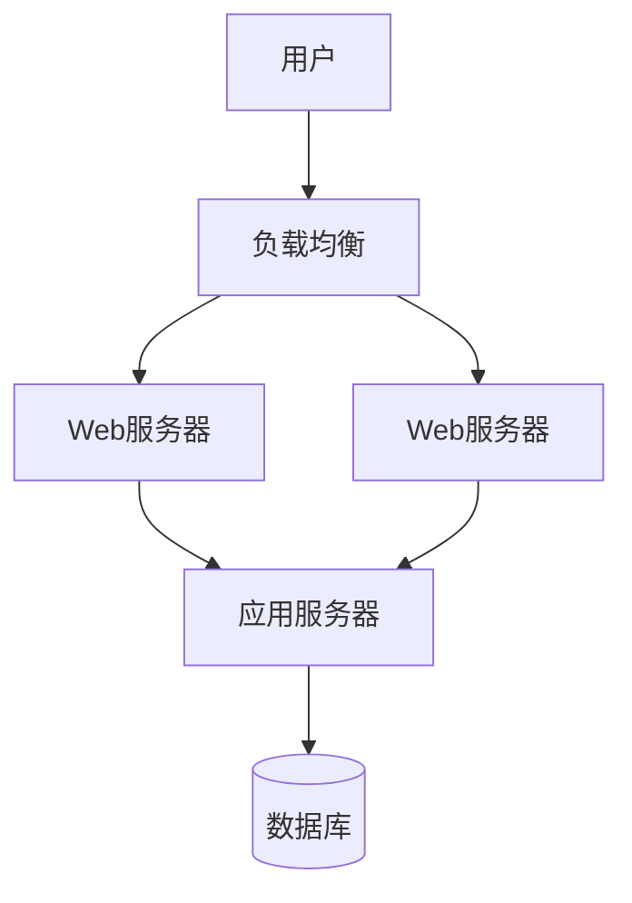

# Arch PPT - 专业架构演示平台

基于 Reveal.js + Markdown 的架构演示工具，专为软件架构师设计的 PPT 制作平台。

## ✨ 核心特性

- 📝 **Markdown 驱动 PPT** - 用熟悉的 Markdown 语法快速制作专业演示
- 🏗️ **架构图专家** - 内置 Mermaid，轻松绘制各种架构图表
- ⚡ **实时预览** - Vite 驱动的热重载，编辑即刻看到效果
- 🎨 **专业演示** - Reveal.js 提供的丰富过渡动画和演讲者模式
- 📱 **全平台适配** - 支持桌面、移动端、投影仪等各种展示场景
- 🔧 **可选增强** - 可集成 Tailwind CSS 和 D3.js 扩展功能

## 🚀 快速开始

```bash
# 安装依赖
npm install

# 启动开发服务器
npm run dev

# 构建演示文件
npm run build
```

启动后访问 http://localhost:5173 查看演示效果。

## 📁 项目结构

```
project/
├── slides/                 # 存放 Markdown 演示文件
│   └── demo.md             # 示例演示
├── src/                    # 核心代码
│   ├── main.ts             # 应用入口
│   ├── lib/                # 核心功能库
│   └── styles/             # 样式文件
├── public/
│   └── assets/             # 静态资源（图片等）
└── README.md
```

## 📝 制作 PPT 演示

### 基础语法

使用标准 Markdown 语法编写内容：

```markdown
# 我的架构演示
项目介绍和概述

---
## 系统架构概览
- 前端应用
- 后端服务 
- 数据存储

---
## 技术栈选择
### 前端技术
- React / Vue
- TypeScript

### 后端技术
- Node.js / Java
- MySQL / Redis
```

### 分页规则

- `---` 创建新的水平页面（主要内容页）
- `--` 创建垂直子页面（详细说明页）

## 🏗️ 架构图绘制

### Mermaid 图表（主要）

最常用的架构图表工具：

```markdown
## 系统架构图


```

### 支持的图表类型

- **流程图** (`flowchart`) - 系统架构、业务流程
- **序列图** (`sequenceDiagram`) - 接口调用、时序关系  
- **类图** (`classDiagram`) - 代码结构、模块关系
- **状态图** (`stateDiagram`) - 状态转换、生命周期
- **甘特图** (`gantt`) - 项目进度、里程碑规划

### 架构图最佳实践

1. **保持简洁** - 一页一个主要概念
2. **层次清晰** - 从宏观到微观逐步展开
3. **标注说明** - 关键组件添加文字说明
4. **统一风格** - 使用一致的图表样式

## 🖼️ 图片和资源

### 图片使用

将图片放在 `public/assets/` 目录，在 Markdown 中引用：

```markdown

```

### 支持格式

- **SVG** - 推荐用于架构图和矢量图
- **PNG/JPG** - 通用图片格式
- **WebP** - 现代浏览器优化格式

## 🎨 代码展示

### 语法高亮

支持多种编程语言的代码高亮：

```markdown
```javascript
// JavaScript 示例
const express = require('express');
const app = express();

app.get('/api/users', (req, res) => {
  res.json({ users: [] });
});
```

```java  
// Java 示例
public class UserService {
    public List<User> getUsers() {
        return userRepository.findAll();
    }
}
```
```

## 🎛️ 演示控制

### 键盘快捷键

- `→` / `Space` - 下一页
- `←` / `Shift+Space` - 上一页  
- `↓` - 向下翻页（垂直子页面）
- `↑` - 向上翻页
- `ESC` - 演示概览
- `S` - 演讲者模式
- `F` - 全屏模式

### 演讲者功能

- **演讲者备注** - 仅演讲者可见的提示内容
- **时间控制** - 演示计时和进度追踪
- **双屏显示** - 演讲者屏幕和观众屏幕分离

## 🎨 样式定制（可选）

### Tailwind CSS

如需更丰富的样式控制，可启用 Tailwind：

```typescript
// 在 src/main.ts 中取消注释
import './styles/tailwind.css';
```

然后安装依赖：

```bash
npm install -D tailwindcss @tailwindcss/typography
```

### 自定义主题

修改 `src/styles/theme.css` 文件自定义样式：

```css
/* 自定义颜色 */
.reveal h1 { color: #your-color; }

/* 自定义字体 */
.reveal { font-family: 'Your-Font', sans-serif; }
```

## 🔧 高级功能

### D3.js 图表（可选）

对于需要复杂交互的架构图，可使用 D3：

```markdown
<div data-d3="arch" data-config='{"nodes":[...],"edges":[...]}'></div>
```

**注意**: D3 仅作为 Mermaid 的补充工具，日常使用推荐 Mermaid。

### 配置选项

在 `src/main.ts` 中调整 Reveal.js 配置：

```typescript
const deck = new Reveal({
  controls: true,          // 显示控制按钮
  progress: true,          // 显示进度条
  center: true,            // 垂直居中
  transition: 'slide'      // 切换动画
});
```

## 📱 多设备支持

### 响应式设计

- **桌面演示** - 大屏投影、会议室展示
- **移动查看** - 手机、平板浏览和分享
- **打印输出** - PDF 导出和纸质打印

### 触控支持

- **手势导航** - 滑动切换页面
- **触摸友好** - 大按钮、易点击的交互元素

## 🚀 部署发布

### 构建命令

```bash
# 生产构建
npm run build

# 预览构建结果  
npm run preview
```

### 部署选项

- **GitHub Pages** - 免费的静态站点托管
- **Netlify/Vercel** - 现代化部署平台
- **企业内网** - Nginx/Apache 静态文件服务
- **CDN** - 阿里云 OSS、腾讯云 COS 等

## 💡 使用技巧

### 架构演示建议

1. **开场** - 项目背景和目标
2. **概览** - 整体架构鸟瞰图
3. **分层** - 逐层深入技术细节
4. **关键点** - 重点技术决策说明
5. **总结** - 架构优势和后续规划

### 内容组织

- **一页一概念** - 避免信息过载
- **渐进展示** - 利用垂直分页展开细节
- **视觉引导** - 用图表和动画引导注意力

## 🛠️ 故障排除

### 常见问题

**Q: 页面显示空白**  
A: 检查 Markdown 文件路径，确保 `slides/demo.md` 存在

**Q: 图片不显示**  
A: 确保图片放在 `public/assets/` 目录，使用 `assets/image.png` 路径

**Q: Mermaid 图表不渲染**  
A: 检查语法是否正确，参考 [Mermaid 官方文档](https://mermaid.js.org/)

## 📄 许可证

MIT License

## 🤝 贡献指南

欢迎提交 Issue 和 Pull Request 改进项目！

---

**开始制作你的专业架构演示吧！** 🎯

这是一个专注于 **PPT 制作** 和 **架构图展示** 的工具，让复杂的技术方案变得清晰易懂。