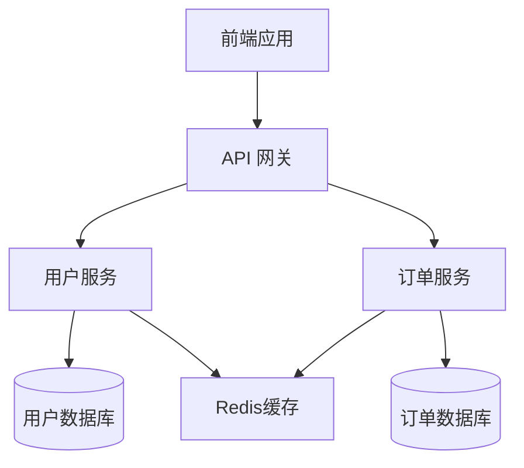

# 系统架构设计

## 整体架构图

```mermaid
flowchart TD
    A[前端应用] --> B[API 网关]
    B --> C[用户服务]
    B --> D[订单服务]
    C --> E[(用户数据库)]
    D --> F[(订单数据库)]
    C --> G[Redis缓存]
    D --> G
```

## 关键设计决策
- **微服务架构** - 独立部署和扩展
- **API 网关** - 统一入口和安全控制
- **缓存层** - 提升查询性能
