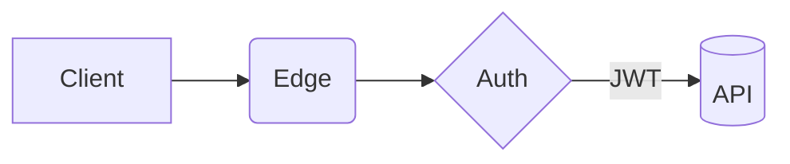

# 架构演示标题
副标题

---
## 架构图（Mermaid）


---
## 图片渲染（统一风格）
使用相对路径：


---
## 代码高亮
```ts
export function greet(name: string) {
  return `Hello, ${name}`;
}
```

---
## D3 架构图（arch JSON）
```d3-arch
{
  "layout": { "type": "dag", "rankdir": "LR", "nodeGap": 120, "levelGap": 160 },
  "nodes": [
    { "id": "gw", "label": "API Gateway" },
    { "id": "auth", "label": "Auth" },
    { "id": "user", "label": "User" },
    { "id": "order", "label": "Order" },
    { "id": "db", "label": "Postgres" }
  ],
  "edges": [
    { "source": "gw", "target": "auth" },
    { "source": "gw", "target": "user" },
    { "source": "user", "target": "order" },
    { "source": "order", "target": "db" }
  ],
  "interactions": { "zoom": true, "drag": true }
}
```

---
## D3 图表示例（条形图）
<div data-d3="bar" data-config='{"data":[1,2,3,5,8,13],"width":640,"height":320}'></div>


