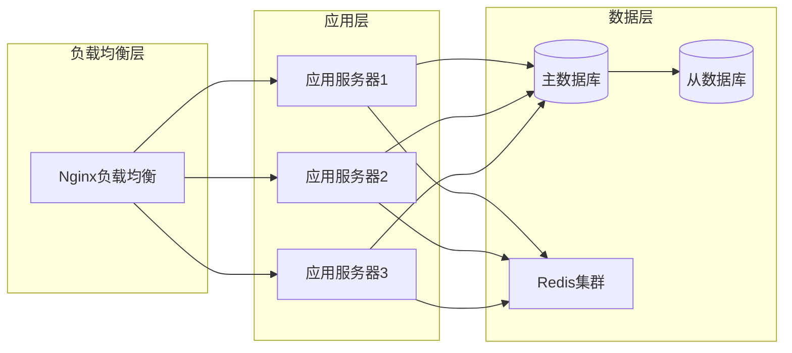

# 部署架构

## 生产环境部署图

```mermaid
flowchart LR
    subgraph "负载均衡层"
        LB[Nginx负载均衡]
    end
    
    subgraph "应用层"
        A1[应用服务器1]
        A2[应用服务器2] 
        A3[应用服务器3]
    end
    
    subgraph "数据层"
        M[(主数据库)]
        S[(从数据库)]
        R[Redis集群]
    end
    
    LB --> A1
    LB --> A2
    LB --> A3
    
    A1 --> M
    A2 --> M
    A3 --> M
    
    M --> S
    
    A1 --> R
    A2 --> R
    A3 --> R
```

## 容量规划
- **并发用户**: 10,000+
- **QPS**: 5,000+
- **可用性**: 99.9%
