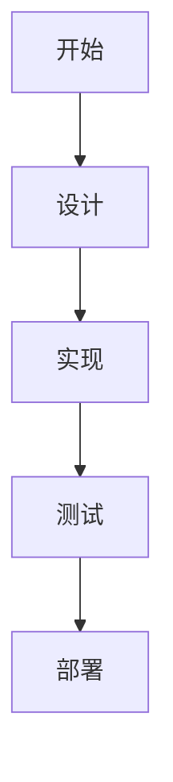

# Fragment 分步显示演示

演示如何在单个幻灯片中分步显示内容。

---

## 基础 Fragment 用法

<p class="fragment">👋 第一步：这段文字首先出现</p>

<p class="fragment">✨ 第二步：然后这段文字出现</p>

<p class="fragment">🎯 第三步：最后这段文字出现</p>

---

## 不同的 Fragment 动画效果

<p class="fragment fade-in">渐入效果 (fade-in)</p>

<p class="fragment fade-out">渐出效果 (fade-out)</p>

<p class="fragment fade-up">从下往上 (fade-up)</p>

<p class="fragment fade-down">从上往下 (fade-down)</p>

<p class="fragment fade-left">从右往左 (fade-left)</p>

<p class="fragment fade-right">从左往右 (fade-right)</p>

---

## 代码块分步展示

```python
# 基础代码结构
def process_data():
    pass
```

<div class="fragment">

```python
# 添加数据加载
def process_data():
    data = load_data()  # 第一步添加
    pass
```

</div>

<div class="fragment">

```python
# 添加数据处理
def process_data():
    data = load_data()
    cleaned_data = clean_data(data)  # 第二步添加
    pass
```

</div>

<div class="fragment">

```python
# 完整实现
def process_data():
    data = load_data()
    cleaned_data = clean_data(data)
    result = analyze_data(cleaned_data)  # 第三步添加
    return result
```

</div>

---

## 列表项逐一显示

### 项目特性：

- <span class="fragment">🚀 高性能</span>
- <span class="fragment">🔒 安全可靠</span>
- <span class="fragment">📱 响应式设计</span>
- <span class="fragment">🌍 国际化支持</span>
- <span class="fragment">🔧 易于维护</span>

---

## 图片和图表分步展示

<div class="fragment">
<h3>第一阶段：架构设计</h3>

</div>

<div class="fragment">
<h3>第二阶段：实现细节</h3>



</div>

<div class="fragment">
<h3>第三阶段：性能优化</h3>
<p>✅ 完成架构设计<br>
✅ 完成核心实现<br>
🔄 正在进行性能优化</p>
</div>

---

## 自定义顺序和索引

<p class="fragment" data-fragment-index="3">第四个出现 (index=3)</p>

<p class="fragment" data-fragment-index="1">第二个出现 (index=1)</p>

<p class="fragment" data-fragment-index="2">第三个出现 (index=2)</p>

<p class="fragment" data-fragment-index="0">第一个出现 (index=0)</p>

---

## 高亮和强调效果

<p>
在这段文字中，我们可以
<span class="fragment highlight-red">高亮重要</span>
的部分，或者
<span class="fragment highlight-blue">突出显示</span>
关键信息。
</p>

<p class="fragment">
也可以使用
<span class="fragment highlight-green">绿色高亮</span>
来表示成功状态。
</p>

---

## 组合动画效果

<div class="fragment fade-in-then-out">
<h3>这个标题会先出现，然后消失</h3>
</div>

<div class="fragment fade-in-then-semi-out">
<p>这段文字会出现，然后变得半透明</p>
</div>

<div class="fragment">
<h3>最终显示的内容</h3>
<p>前面的内容已经完成了它们的使命</p>
</div>
