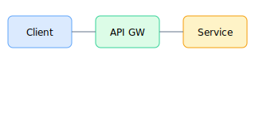

# 多媒体展示

展示图片、视频和其他媒体内容的集成。

---

## 图片展示

### 基础图片

### 带样式的图片

  
  
鼠标悬停查看缩放效果

---

## 图片画廊

  
 this.style.transform='scale(1)', 100)">
    图片 1
  

  
  
 this.style.transform='scale(1)', 100)">
    图片 2
  

  
  
 this.style.transform='scale(1)', 100)">
    图片 3
  

---

## SVG 动画

  <svg width="200" height="200" viewBox="0 0 200 200">
    
    
    <g class="svg-demo">
      <circle cx="100" cy="100" r="30" fill="#ff6b6b"/>
      <path d="M 50 50 Q 100 20 150 50 Q 180 100 150 150 Q 100 180 50 150 Q 20 100 50 50" 
            stroke="#4ecdc4" stroke-width="3" fill="none"/>
    </g>
  </svg>
  
  
SVG 动画演示

