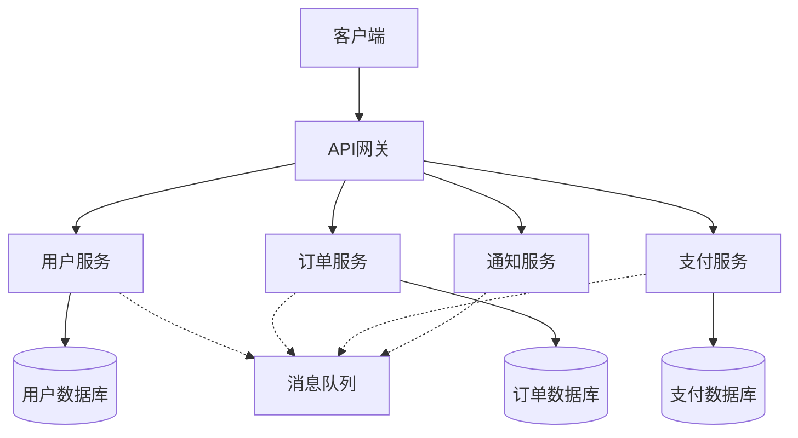

# 🏗️ 架构设计原则

系统架构设计的核心原则和方法论

---

## 🎯 设计原则

### 1. 单一职责原则 (SRP)

**定义**: 每个组件应该只有一个改变的理由

**实践**:
- 微服务按业务域划分
- 组件功能明确且专一
- 避免"上帝对象"

### 2. 开闭原则 (OCP)

**定义**: 对扩展开放，对修改关闭

**实践**:
- 使用接口和抽象
- 插件化架构设计
- 配置驱动的行为

---

## 🏛️ 架构模式

### 微服务架构

**优势**:
- 技术栈自由选择
- 独立部署和扩展
- 故障隔离
- 团队独立开发

---

## ⚖️ 权衡考虑

### 性能 vs 可维护性

| 方面 | 性能优先 | 可维护性优先 |
|------|---------|-------------|
| **架构复杂度** | 可接受更高复杂度 | 简单清晰为主 |
| **代码优化** | 深度优化 | 可读性优先 |
| **技术选择** | 高性能技术栈 | 成熟稳定技术栈 |
| **团队要求** | 需要专家级开发者 | 普通开发者可维护 |

### 一致性 vs 可用性 (CAP定理)

- **CA系统**: 传统RDBMS，强一致性但可用性受限
- **CP系统**: 分布式数据库，保证一致性但可能牺牲可用性
- **AP系统**: NoSQL系统，高可用但最终一致性

---

## 📐 设计步骤

### 1. 需求分析
- 功能需求梳理
- 非功能需求识别
- 约束条件确定

### 2. 架构规划
- 系统边界定义
- 组件职责划分
- 接口设计

### 3. 技术选型
- 技术栈评估
- 性能要求匹配
- 团队技能考虑

### 4. 详细设计
- 数据模型设计
- API设计
- 部署架构设计

---

## 💡 最佳实践

### ✅ 推荐做法

- **从简单开始**: 避免过度设计
- **渐进式改进**: 根据需求演进架构
- **文档先行**: 架构决策记录(ADR)
- **自动化测试**: 保证架构质量
- **监控可观测**: 实时掌握系统状态

### ❌ 避免陷阱

- **银弹思维**: 没有万能的架构模式
- **技术驱动**: 技术选择应服务于业务
- **忽视运维**: 考虑部署和维护成本
- **缺乏验证**: 架构决策需要验证

