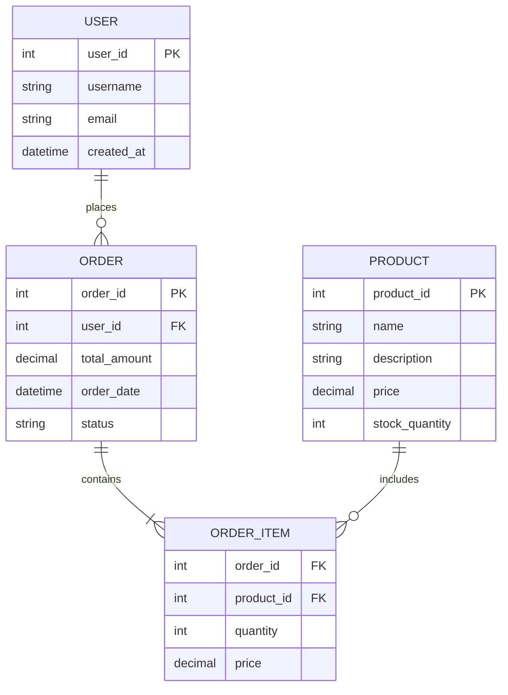
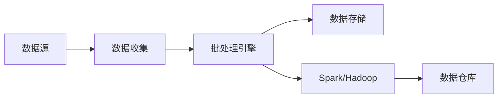
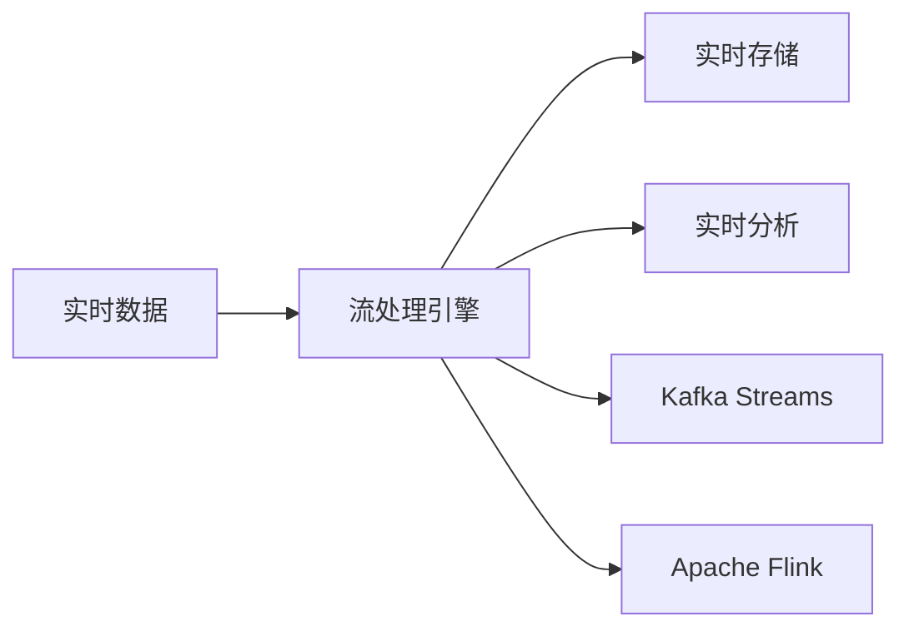
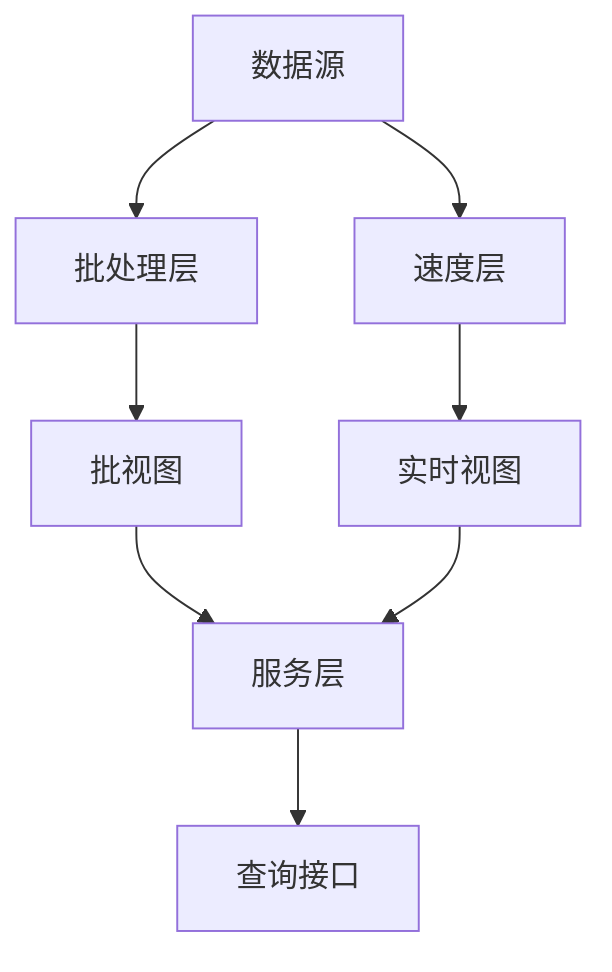
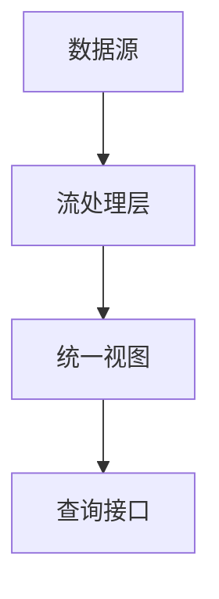

# 📊 数据建模与设计

现代系统的数据架构设计策略

---

## 🗄️ 数据存储选择

### 关系型数据库 (RDBMS)

**适用场景**:
- 复杂查询和事务
- 数据一致性要求高
- 结构化数据

**技术选择**:
- PostgreSQL: 功能丰富，扩展性好
- MySQL: 性能优秀，生态成熟
- Oracle: 企业级功能完善

### NoSQL数据库

**文档数据库 (MongoDB, CouchDB)**:
- 半结构化数据
- 快速原型开发
- 水平扩展友好

**键值存储 (Redis, DynamoDB)**:
- 高性能缓存
- 会话存储
- 计数器和排行榜

**列族数据库 (Cassandra, HBase)**:
- 大数据场景
- 时序数据
- 高写入吞吐量

---

## 📋 数据建模策略

### 1. 概念模型设计

### 2. 规范化与反规范化

| 策略 | 优势 | 劣势 | 适用场景 |
|------|------|------|----------|
| **规范化** | 数据一致性 存储效率 | 查询复杂 性能开销 | 事务系统 数据仓库 |
| **反规范化** | 查询性能 读取效率 | 数据冗余 维护复杂 | 读密集系统 分析场景 |

---

## 🌊 数据流架构

### 批处理 vs 流处理

### 批处理 (Batch Processing)

**特点**:
- 高吞吐量
- 延迟较高
- 适合大数据分析

### 流处理 (Stream Processing)

**特点**:
- 低延迟
- 实时处理
- 适合实时监控

---

## 🏗️ 数据架构模式

### Lambda架构

**优势**: 容错性好，支持批处理和实时处理
**劣势**: 架构复杂，需要维护两套代码

### Kappa架构

**优势**: 架构简单，统一处理逻辑
**劣势**: 依赖流处理技术栈

---

## 📈 数据一致性策略

### 分布式事务

### 两阶段提交 (2PC)

**优点**: 强一致性保证
**缺点**: 性能开销大，阻塞风险

### Saga模式

**优点**: 高可用性，支持长事务
**缺点**: 最终一致性，补偿逻辑复杂

### 事件溯源 (Event Sourcing)

**优点**: 完整历史记录，易于重放
**缺点**: 存储开销大，查询复杂

---

## 🛠️ 实践建议

### 数据库设计原则

1. **性能优先的设计**
   - 合理使用索引
   - 避免N+1查询
   - 考虑查询模式

2. **扩展性考虑**
   - 水平分片策略
   - 读写分离
   - 缓存层设计

3. **数据治理**
   - 数据质量监控
   - 数据血缘追踪
   - 权限管理

### 常见反模式

❌ **单表巨无霸**: 所有数据放在一张表
❌ **过度规范化**: 为了规范而规范
❌ **忽视查询模式**: 设计时不考虑实际使用
❌ **缺乏备份策略**: 没有数据恢复计划

