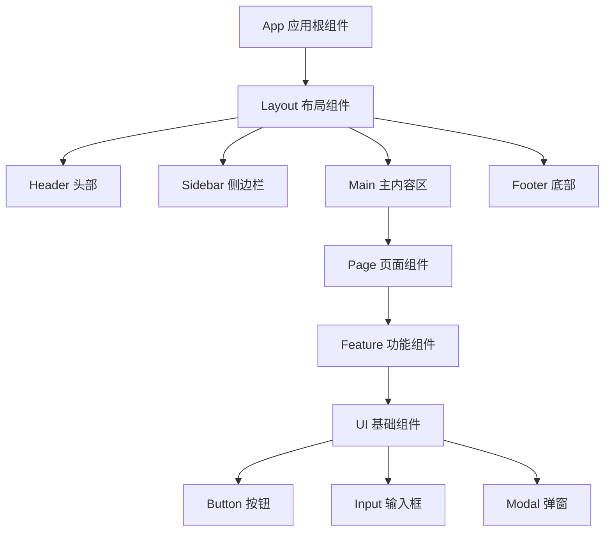
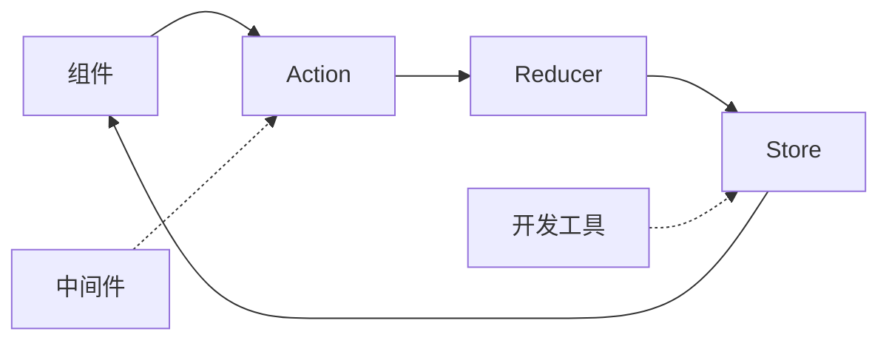
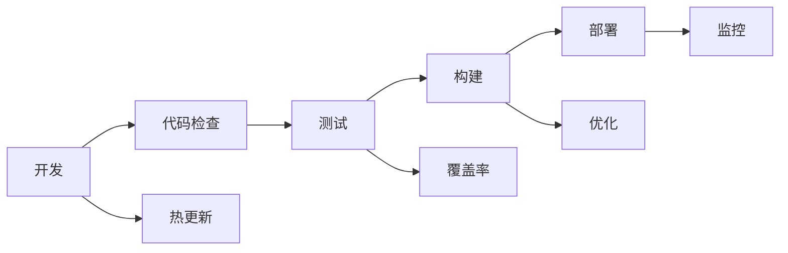

# 📱 前端架构设计

现代前端系统的架构设计与最佳实践

---

## 🏗️ 前端架构演进

### 传统架构 → 现代架构

<div class="architecture-evolution">

### 传统多页应用 (MPA)
```
浏览器 → 服务器 → 完整HTML页面
特点：服务端渲染，页面跳转刷新
```

### 单页应用 (SPA)
```
浏览器 ← → API服务器
特点：客户端渲染，路由控制
```

### 微前端架构
```
主应用容器
├── 用户管理模块
├── 订单处理模块
└── 数据分析模块
特点：模块独立开发、部署
```

### 全栈框架 (Full-Stack)
```
Next.js/Nuxt.js/SvelteKit
特点：SSR/SSG + 客户端水合
```

</div>

---

## ⚛️ 组件化架构

### 组件设计原则

<div class="component-principles">

### 1. 单一职责
每个组件只负责一个明确的功能

### 2. 可复用性
组件应该在不同场景下可重用

### 3. 可组合性
小组件可以组合成大组件

### 4. 明确接口
通过Props定义清晰的输入输出

</div>

### 组件层次结构



---

## 🔄 状态管理

### 状态管理模式对比

| 方案 | 复杂度 | 性能 | 调试 | 适用场景 |
|------|--------|------|------|----------|
| **useState** | 低 | 高 | 简单 | 组件内状态 |
| **Context** | 中 | 中 | 中等 | 跨组件共享 |
| **Redux** | 高 | 中 | 优秀 | 大型应用 |
| **Zustand** | 低 | 高 | 中等 | 中小型应用 |
| **Recoil** | 中 | 高 | 优秀 | Facebook生态 |

### Redux架构模式



---

## 🎨 UI架构设计

### 设计系统 (Design System)

<div class="design-system">

### 组件库层级

```
设计原子 (Design Tokens)
├── 颜色变量
├── 字体变量
├── 间距变量
└── 阴影变量

基础组件 (Base Components)
├── Button 按钮
├── Input 输入框
├── Typography 排版
└── Icon 图标

复合组件 (Composite Components)
├── Form 表单
├── Table 表格
├── Navigation 导航
└── Layout 布局

业务组件 (Business Components)
├── UserProfile 用户资料
├── ProductCard 产品卡片
└── OrderSummary 订单摘要
```

</div>

### CSS架构方法

<div class="css-methodologies">

### BEM命名规范
```css
/* Block Element Modifier */
.card { }
.card__title { }
.card__title--large { }
.card--featured { }
```

### CSS-in-JS
```javascript
const StyledButton = styled.button`
  background: ${props => props.primary ? 'blue' : 'gray'};
  padding: 0.5rem 1rem;
  border-radius: 4px;
`;
```

### CSS模块化
```css
/* Button.module.css */
.button {
  padding: 0.5rem 1rem;
}

.primary {
  background: blue;
}
```

</div>

---

## 🚀 性能优化策略

### 代码分割 (Code Splitting)

<div class="performance-strategies">

### 路由级分割
```javascript
// React Router + Lazy Loading
const HomePage = lazy(() => import('./pages/Home'));
const AboutPage = lazy(() => import('./pages/About'));

<Route path="/" element={<HomePage />} />
<Route path="/about" element={<AboutPage />} />
```

### 组件级分割
```javascript
// 动态导入大型组件
const HeavyChart = lazy(() => import('./HeavyChart'));

function Dashboard() {
  return (
    <Suspense fallback={<Loading />}>
      <HeavyChart />
    </Suspense>
  );
}
```

</div>

### 渲染优化

<div class="rendering-optimization">

### 虚拟滚动
```javascript
// 大列表优化
<VirtualizedList
  height={400}
  itemCount={10000}
  itemSize={50}
  renderItem={({ index, style }) => (
    <div style={style}>Item {index}</div>
  )}
/>
```

### 懒加载
```javascript
// 图片懒加载

```

</div>

---

## 🛠️ 开发工具链

### 构建工具对比

| 工具 | 构建速度 | 配置复杂度 | 生态系统 | 适用项目 |
|------|----------|------------|----------|----------|
| **Webpack** | 中 | 高 | 丰富 | 大型项目 |
| **Vite** | 快 | 低 | 快速增长 | 现代项目 |
| **Parcel** | 快 | 极低 | 中等 | 小型项目 |
| **Rollup** | 中 | 中 | 专业 | 库开发 |

### 开发工作流



---

## 📱 响应式与适配

### 响应式设计策略

<div class="responsive-strategies">

### 移动优先 (Mobile First)
```css
/* 基础样式：移动端 */
.container {
  padding: 1rem;
}

/* 平板端 */
@media (min-width: 768px) {
  .container {
    padding: 2rem;
  }
}

/* 桌面端 */
@media (min-width: 1024px) {
  .container {
    padding: 3rem;
  }
}
```

### 容器查询
```css
/* 基于容器大小的样式 */
@container (min-width: 400px) {
  .card {
    display: flex;
  }
}
```

</div>

### 多端适配方案

<div class="multi-platform">

### PWA (渐进式Web应用)
- 离线访问能力
- 原生应用体验
- 推送通知支持

### 小程序/混合应用
- 统一代码库
- 多平台发布
- 原生功能调用

### 跨平台框架
- React Native
- Flutter Web
- Ionic

</div>

---

## 🔧 架构最佳实践

### 项目结构组织

```
src/
├── components/          # 通用组件
│   ├── ui/             # 基础UI组件
│   └── business/       # 业务组件
├── pages/              # 页面组件
├── hooks/              # 自定义Hooks
├── store/              # 状态管理
├── utils/              # 工具函数
├── services/           # API服务
├── assets/             # 静态资源
└── styles/             # 样式文件
```

### 代码质量保证

<div class="code-quality">

### 静态分析
```json
// ESLint + Prettier + TypeScript
{
  "scripts": {
    "lint": "eslint src --ext .ts,.tsx",
    "format": "prettier --write src",
    "type-check": "tsc --noEmit"
  }
}
```

### 自动化测试
```javascript
// Jest + Testing Library
test('renders learn react link', () => {
  render(<App />);
  const linkElement = screen.getByText(/learn react/i);
  expect(linkElement).toBeInTheDocument();
});
```

</div>

### 性能监控

- **Core Web Vitals**: LCP, FID, CLS
- **资源加载**: Bundle分析，懒加载效果
- **用户体验**: 错误监控，性能追踪
- **A/B测试**: 功能效果验证

<style>
.architecture-evolution {
  margin: 20px 0;
}

.architecture-evolution h3 {
  color: #495057;
  margin: 15px 0 10px 0;
  font-size: 1.1em;
}

.component-principles h3 {
  color: #495057;
  margin: 15px 0 10px 0;
  font-size: 1.1em;
}

.design-system {
  background: #f8f9fa;
  border-radius: 8px;
  padding: 20px;
  margin: 15px 0;
}

.css-methodologies h3 {
  color: #495057;
  margin: 15px 0 10px 0;
  font-size: 1.1em;
}

.performance-strategies h3 {
  color: #495057;
  margin: 15px 0 10px 0;
  font-size: 1.1em;
}

.rendering-optimization h3 {
  color: #495057;
  margin: 15px 0 10px 0;
  font-size: 1.1em;
}

.responsive-strategies h3 {
  color: #495057;
  margin: 15px 0 10px 0;
  font-size: 1.1em;
}

.multi-platform h3 {
  color: #495057;
  margin: 15px 0 10px 0;
  font-size: 1.1em;
}

.code-quality h3 {
  color: #495057;
  margin: 15px 0 10px 0;
  font-size: 1.1em;
}

table {
  width: 100%;
  border-collapse: collapse;
  margin: 20px 0;
  font-size: 0.9em;
}

table th, table td {
  border: 1px solid #dee2e6;
  padding: 8px;
  text-align: center;
}

table th {
  background-color: #f8f9fa;
  font-weight: 600;
}

pre {
  background: #f8f9fa;
  border: 1px solid #e9ecef;
  border-radius: 4px;
  padding: 1rem;
  margin: 1rem 0;
  overflow-x: auto;
}

code {
  background: #f8f9fa;
  padding: 0.2rem 0.4rem;
  border-radius: 3px;
  font-size: 0.9em;
}
</style>
