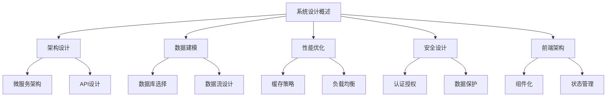

# 系统设计概述

欢迎来到系统设计专题演示！

---

## 📋 本专题内容

这个专题将深入讲解现代系统设计的各个方面：

### 🏗️ 架构设计 
系统架构的设计原则和最佳实践

### 📊 数据建模
数据库设计和数据流架构

### 🚀 性能优化
系统性能优化策略和实现

### 🛡️ 安全设计
安全架构和防护机制

### 📱 前端架构
现代前端架构设计

---

## 🎯 学习目标

通过本专题，您将学习到：

- ✅ **架构思维**: 如何从零开始设计大型系统
- ✅ **技术选型**: 根据需求选择合适的技术栈
- ✅ **扩展性设计**: 设计可扩展的系统架构
- ✅ **性能优化**: 识别和解决性能瓶颈
- ✅ **安全考量**: 构建安全可靠的系统
- ✅ **最佳实践**: 行业经验和实战技巧

---

## 📚 内容结构

---

## 🚀 开始学习

点击下方按钮或使用方向键开始深入学习各个主题！

  

    👇 向下导航开始学习 👇
  

