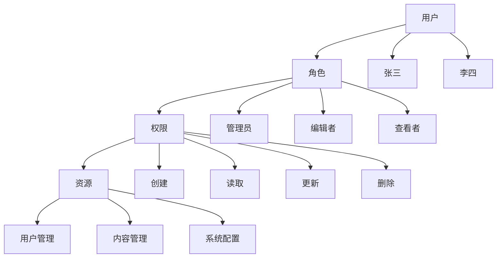
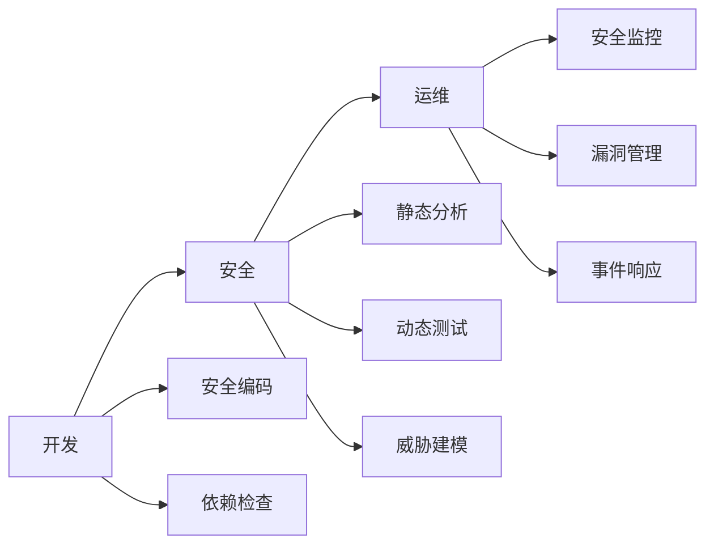

# 🛡️ 安全设计与实现

构建安全可靠的系统架构

---

## 🔐 安全设计原则

### 1. 零信任架构 (Zero Trust)

<div class="security-principle">

**核心理念**: "永不信任，始终验证"

**实施要点**:
- 身份验证和授权
- 最小权限原则
- 持续安全监控
- 网络微分段

</div>

### 2. 深度防御 (Defense in Depth)

<div class="security-principle">

**多层防护**:
- 网络层：防火墙、IDS/IPS
- 应用层：WAF、输入验证
- 数据层：加密、访问控制
- 用户层：多因子认证

</div>

---

## 🔑 身份认证与授权

### 认证方式对比

| 认证方式 | 安全级别 | 用户体验 | 实现复杂度 | 适用场景 |
|----------|----------|----------|------------|----------|
| **密码** | 低 | 简单 | 低 | 基础应用 |
| **短信验证** | 中 | 中等 | 中 | 移动应用 |
| **TOTP** | 高 | 中等 | 中 | 企业应用 |
| **硬件令牌** | 极高 | 复杂 | 高 | 关键系统 |
| **生物识别** | 高 | 简单 | 高 | 移动设备 |

### RBAC权限模型



---

## 🔒 数据安全

### 加密策略

<div class="encryption-strategies">

### 传输加密 (TLS/SSL)

**目的**: 保护数据在网络传输过程中的安全
**实现**: HTTPS、TLS 1.3、证书管理
**最佳实践**: 
- 使用最新TLS版本
- 配置强加密套件
- 实施HSTS策略

### 存储加密

**目的**: 保护静态数据安全
**实现**: 
- 对称加密 (AES-256)
- 非对称加密 (RSA, ECC)
- 数据库透明加密

### 应用层加密

**目的**: 应用级别的数据保护
**实现**:
- 字段级加密
- 令牌化 (Tokenization)
- 格式保持加密 (FPE)

</div>

---

## 🚫 常见安全威胁与防护

### OWASP Top 10 防护

<div class="threat-protection">

### 1. 注入攻击
**威胁**: SQL注入、NoSQL注入、命令注入
**防护**: 
- 参数化查询
- 输入验证和清理
- 最小权限数据库用户

### 2. 身份验证失效
**威胁**: 弱密码、会话劫持
**防护**:
- 强密码策略
- 多因子认证
- 安全会话管理

### 3. 敏感数据泄露
**威胁**: 数据明文存储、传输
**防护**:
- 数据分类和标记
- 加密敏感数据
- 安全删除策略

### 4. XML外部实体注入
**威胁**: XXE攻击
**防护**:
- 禁用外部实体
- 使用安全的XML解析器
- 输入验证

</div>

---

## 🔍 安全监控与审计

### 安全日志记录

<div class="logging-strategy">

**关键事件记录**:
- 认证成功/失败
- 权限变更
- 数据访问
- 系统配置更改
- 异常行为

**日志格式标准**:
```json
{
  "timestamp": "2024-01-15T10:30:00Z",
  "user_id": "user123",
  "action": "login_attempt",
  "result": "success",
  "ip_address": "192.168.1.100",
  "user_agent": "Mozilla/5.0...",
  "risk_score": 2
}
```

</div>

### 实时监控指标

- **异常登录**: 异地登录、多地同时登录
- **权限提升**: 角色变更、权限异常使用
- **数据访问模式**: 大量数据下载、敏感数据访问
- **系统异常**: 大量失败请求、性能异常

---

## 🛠️ 安全开发实践

### DevSecOps集成



### 安全代码审查

<div class="code-review-checklist">

**检查清单**:
- ✅ 输入验证和清理
- ✅ 输出编码
- ✅ 认证和会话管理
- ✅ 访问控制实现
- ✅ 错误处理和日志记录
- ✅ 密码学正确使用
- ✅ 第三方库安全性

</div>

---

## 📋 安全合规要求

### 行业标准

<div class="compliance-standards">

### ISO 27001
**范围**: 信息安全管理体系
**要求**: 风险管理、控制措施、持续改进

### PCI DSS
**范围**: 支付卡行业数据安全
**要求**: 网络安全、数据保护、访问控制

### GDPR
**范围**: 欧盟数据保护
**要求**: 数据主体权利、隐私设计、违规通知

</div>

### 安全评估框架

1. **威胁建模**
   - 资产识别
   - 威胁分析
   - 风险评估
   - 缓解措施

2. **渗透测试**
   - 黑盒测试
   - 白盒测试
   - 社会工程学测试

3. **安全审计**
   - 配置审计
   - 代码审计
   - 权限审计

---

## 💡 安全最佳实践

<div class="best-practices">

### 开发阶段
- 🔒 **安全设计**: 威胁建模，安全架构设计
- 🛡️ **安全编码**: 遵循安全编码标准
- 🔍 **代码审查**: 包含安全审查项目

### 部署阶段
- 🛠️ **安全配置**: 强化服务器和应用配置
- 🔐 **密钥管理**: 使用专用密钥管理系统
- 📊 **监控部署**: 实施安全监控和告警

### 运维阶段
- 🔄 **定期更新**: 及时修补安全漏洞
- 📈 **持续监控**: 24/7安全监控
- 🚨 **事件响应**: 建立安全事件响应流程

</div>

<style>
.security-principle {
  background: #f8f9fa;
  border: 1px solid #dee2e6;
  border-radius: 8px;
  padding: 20px;
  margin: 15px 0;
  border-left: 4px solid #dc3545;
}

.encryption-strategies h3 {
  color: #495057;
  margin: 20px 0 10px 0;
  font-size: 1.1em;
}

.threat-protection h3 {
  color: #dc3545;
  margin: 15px 0 10px 0;
  font-size: 1.1em;
}

.logging-strategy {
  background: #f8f9fa;
  border-radius: 8px;
  padding: 20px;
  margin: 15px 0;
}

.code-review-checklist {
  background: #e7f4fd;
  border: 1px solid #b8daff;
  border-radius: 8px;
  padding: 20px;
  margin: 15px 0;
}

.compliance-standards h3 {
  color: #495057;
  margin: 15px 0 10px 0;
  font-size: 1.1em;
}

.best-practices {
  margin: 20px 0;
}

.best-practices h3 {
  color: #495057;
  margin: 20px 0 10px 0;
}

table {
  width: 100%;
  border-collapse: collapse;
  margin: 20px 0;
  font-size: 0.9em;
}

table th, table td {
  border: 1px solid #dee2e6;
  padding: 10px;
  text-align: left;
}

table th {
  background-color: #f8f9fa;
  font-weight: 600;
}
</style>
