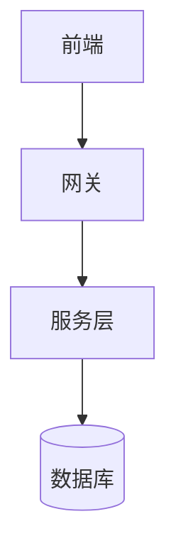
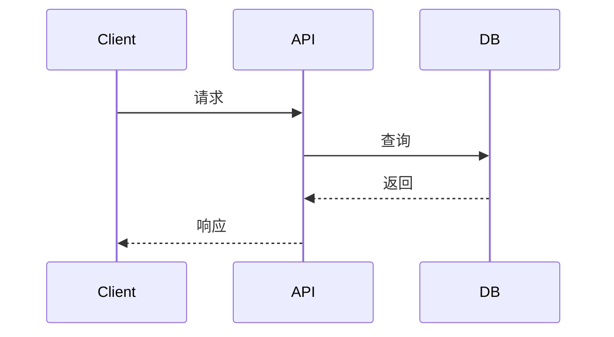

## 架构演示平台方案设计（Reveal.js + Markdown + Mermaid + 可选扩展）

### 1. 项目定位与目标
- **核心定位**: 专为软件架构师设计的 **PPT 制作和演示平台**
- **主要功能**: 
  - **Markdown 驱动的 PPT 制作** - 用熟悉语法快速创建专业演示
  - **架构图绘制专家** - 内置 Mermaid，轻松制作各类架构图表
  - **实时预览演示** - 所见即所得的编辑体验
- **辅助功能**: Tailwind CSS 样式增强、D3.js 复杂图表支持
- **非目标**: 不追求复杂的数据可视化，专注于架构演示场景[[memory:5498224]]

### 2. 技术选型与理由
- **核心引擎: Reveal.js**
  - 成熟的 PPT 演示框架，专业的动画和演讲者模式
- **内容驱动: Markdown + markdown-it**
  - 架构师熟悉的语法，专注内容创作
- **架构图核心: Mermaid.js**
  - 声明式语法，覆盖 90% 架构图场景（流程图、序列图、类图等）
- **构建工具: Vite + TypeScript**
  - 快速开发体验，类型安全保障
- **可选扩展**:
  - **Tailwind CSS** - 需要样式定制时启用
  - **D3.js** - 需要复杂交互图表时补充（非主要功能）

### 3. 整体架构
```
[用户编写 Markdown] 
        ↓
[markdown-it 解析] → [分片处理] → [Reveal.js 演示]
        ↓                              ↓
[Mermaid 架构图渲染]              [演讲者模式/动画]
        ↓
[highlight.js 代码高亮]
        ↓
[可选: D3 复杂图表]
```

### 4. 核心功能流程
1. **内容创建**: 用户编写 Markdown 文件（`slides/*.md`）
2. **实时解析**: markdown-it 转换 + 按 `---`/`--` 分片
3. **图表渲染**: Mermaid 处理架构图、代码高亮
4. **演示展示**: Reveal.js 提供专业演示效果
5. **可选增强**: 按需启用 Tailwind 样式或 D3 复杂图表

### 5. 目录结构
```
project-root/
├─ slides/
│  └─ demo.md                # PPT 内容文件
├─ src/
│  ├─ main.ts                # 应用入口
│  ├─ lib/
│  │  ├─ markdown/           # Markdown 处理
│  │  ├─ mermaid.ts         # 架构图渲染
│  │  ├─ highlight.ts       # 代码高亮
│  │  └─ d3/ (可选)         # 复杂图表支持
│  └─ styles/
│     ├─ theme.css          # PPT 主题样式
│     └─ tailwind.css (可选) # 样式扩展
├─ public/assets/            # 图片资源
└─ vite.config.ts
```

### 6. Markdown PPT 使用约定

#### 基础语法
```markdown
# PPT 标题页
副标题和介绍

---
## 第一页内容
- 要点1
- 要点2

--
### 子页面（垂直导航）
详细说明内容

---
## 第二页内容
继续演示...
```

#### 架构图绘制（核心功能）
```markdown
## 系统架构


## 接口时序

```

#### 图片和代码
```markdown


```typescript
interface User {
  id: string;
  name: string;
}
```
```

### 7. 关键集成方案

#### 7.1 Reveal.js 核心配置
- 标准 PPT 功能：分页、动画、演讲者模式、PDF 导出
- 插件集成：代码高亮、备注、缩放
- 主题系统：支持深色/浅色主题切换

#### 7.2 Mermaid 架构图引擎
- **主要图表类型**:
  - `flowchart` - 系统架构图、业务流程图
  - `sequenceDiagram` - 接口调用时序图
  - `classDiagram` - 模块关系图
  - `stateDiagram` - 状态转换图
  - `gantt` - 项目计划图
- **配置**: `startOnLoad: false`，与 Reveal 协调渲染
- **主题**: 跟随 PPT 主题自动切换

#### 7.3 可选增强功能
- **Tailwind CSS**: 
  - 使用 `tw-` 前缀避免冲突
  - 仅在需要丰富样式时启用
  - 禁用 preflight 保护 Reveal 基础样式
- **D3.js 复杂图表**:
  - 仅作为 Mermaid 的补充
  - 用于需要复杂交互的特殊场景
  - 通过 `<div data-d3="type">` 方式集成

### 8. 脚手架工具（create-arch-ppt）
```bash
# 安装脚手架
npm install -g create-arch-ppt

# 创建项目
create-arch-ppt my-presentation --with-tailwind

# 快速开始
cd my-presentation
npm install
npm run dev
```

### 9. 使用场景与价值

#### 9.1 目标用户
- **软件架构师** - 技术方案演示、架构评审
- **技术负责人** - 团队培训、项目汇报
- **开发团队** - 技术分享、设计文档

#### 9.2 核心价值
- **提升效率** - Markdown 语法，专注内容而非格式
- **专业演示** - 丰富动画效果，演讲者模式支持
- **架构专家** - 内置图表工具，轻松绘制各类架构图
- **团队协作** - 基于文本文件，支持版本控制

### 10. 与传统工具对比

| 功能 | Arch PPT | PowerPoint | 在线工具 |
|------|----------|------------|----------|
| **内容创作** | Markdown 语法 | 拖拽编辑 | 在线编辑 |
| **架构图** | Mermaid 内置 | 手工绘制 | 专门工具 |
| **版本控制** | Git 友好 | 二进制文件 | 云端同步 |
| **协作方式** | 代码协作 | 文件共享 | 实时协作 |
| **学习成本** | 低（Markdown） | 中等 | 中等 |
| **专业性** | 高 | 高 | 中等 |

### 11. 性能与体积控制
- **懒加载**: Mermaid、可选扩展按需加载
- **代码分割**: Vite 自动优化 vendor 分离
- **资源优化**: 图片压缩、CSS 压缩
- **首屏优化**: 仅渲染当前页面内容

### 12. 构建与部署
- **开发**: `npm run dev` - Vite HMR 热重载
- **构建**: `npm run build` - 生产优化版本
- **部署**: 静态文件，支持任何 Web 服务器
- **导出**: Reveal.js 原生 PDF 导出功能

### 13. 里程碑规划

#### M1 (MVP - 核心 PPT 功能)
- ✅ Vite + Reveal 基础框架
- ✅ Markdown 解析和分片
- ✅ Mermaid 架构图集成
- ✅ 代码高亮和基础样式

#### M2 (增强版 - 完整功能)
- ✅ 可选 Tailwind CSS 集成
- ✅ D3 补充图表支持
- ✅ 完善的错误处理
- ✅ 脚手架工具

#### M3 (生产版 - 优化完善)
- ✅ 性能优化和构建优化
- ✅ 完整文档和示例
- ✅ 多主题支持

### 14. 风险与应对
- **Mermaid 兼容性**: 使用稳定版本，提供语法文档
- **样式冲突**: 命名空间隔离，可选启用 Tailwind
- **学习成本**: 提供完整示例和最佳实践文档
- **功能边界**: 明确定位为 PPT 工具，不追求复杂可视化

### 15. 后续展望
- **主题商店**: 提供更多 PPT 主题选择
- **模板库**: 常见演示场景的模板
- **导出增强**: 更多格式支持（PPTX、图片等）
- **协作功能**: 多人编辑、评论系统

---

## 总结

Arch PPT 是一个**专注于 PPT 制作和架构图演示**的工具平台：

- **核心**: Markdown 驱动的 PPT + Mermaid 架构图
- **特色**: 专为软件架构师优化的演示工具  
- **优势**: 高效创作、专业展示、团队协作
- **定位**: 实用工具，而非复杂的可视化平台

通过聚焦核心需求，提供简单高效的架构演示解决方案。