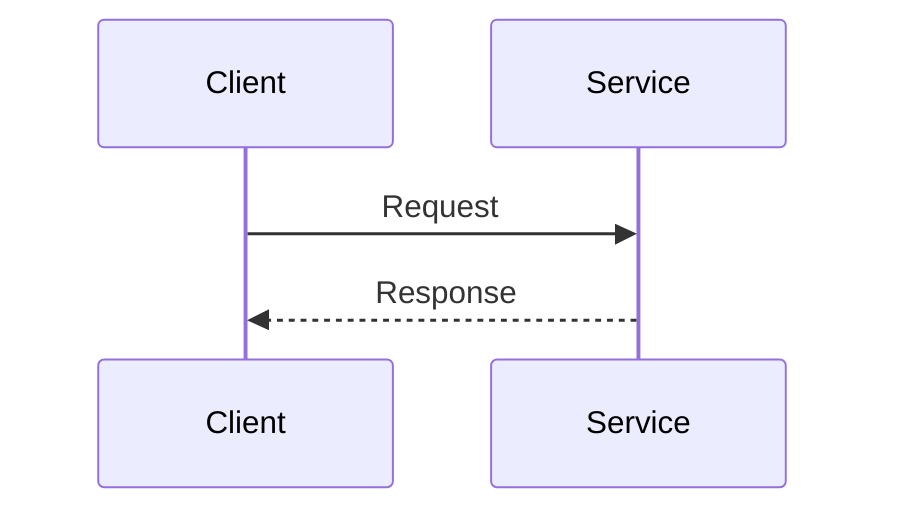
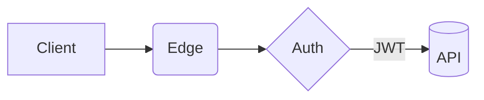

## 架构图演示平台方案设计（Vite + Reveal.js + Markdown + Mermaid + D3 + highlight.js）

### 1. 背景与目标
- **目标**: 为软件架构师提供一套“写 Markdown 即可做演示与画图”的轻量平台，支持现场演示、架构图绘制、代码高亮与交互式可视化。
- **核心诉求**:
  - **所见即所得**: 修改 Markdown 即时热重载；
  - **高质量演示**: Reveal.js 动效、主题、演讲者视图；
  - **架构图与流程图**: 内置 Mermaid 渲染；
  - **交互图形**: D3 支持常见图表（可扩展）；
  - **代码高亮**: 按需语言高亮；
  - **零后端**: 纯前端静态部署。
- **非目标**: 不做复杂用户系统与历史格式兼容，面向现代浏览器与现代前端构建[[memory:5498224]].

### 2. 技术选型与理由
- **构建工具: Vite + TypeScript**
  - 开发时模块热替换（HMR），构建快，支持 ESM 按需加载。
- **演示引擎: Reveal.js**
  - 成熟的幻灯片框架，支持过渡动画、演讲者模式、PDF 导出、插件生态。
- **Markdown 渲染: markdown-it（默认），可切换 marked（可选）**
  - markdown-it 插件生态丰富（attrs、anchor、emoji、TOC），可控的 `highlight` 钩子；
  - 通过适配层保留替换为 marked 的可能，不锁死实现。
- **图形: Mermaid.js + D3.js**
  - Mermaid: 架构图、流程图、序列图等声明式语法；
  - D3: 复杂架构图定制渲染 + 交互式可视化（可封装常用图表）。
- **代码高亮: highlight.js（默认，复用 Reveal 官方插件）/ Prism.js（可选）**
  - 默认采用 highlight.js，以复用 `RevealHighlight` 插件、减少自定义集成复杂度；
  - 未来可在适配层切换到 Prism.js 实现。

### 3. 整体架构
```
[Vite Dev Server] --HMR--> [前端应用]
                              |
                              | 1. 加载 Markdown（本地文件或 URL）
                              v
                       [markdown-it 解析]
                              |
                              | 2. 解析分片（---/--）为 <section>
                              v
                          [Reveal.js]
                              |
                              | 3. 初始化插件（Highlight、Notes、Zoom）
                              v
                  [Mermaid 渲染]  [D3 渲染]
                              |
                              v
                        [最终可交互演示]
```

### 4. 核心流程
1. 读取 `slides/*.md` 或通过 `?src=` 查询参数加载外部 Markdown；
2. 使用 `markdown-it` 转换为 HTML，并按分隔符拆分为 `section`（支持水平/垂直分片）；
3. 初始化 Reveal，启用 `RevealHighlight`、`RevealNotes`、`RevealZoom` 等插件；
4. 对 `language-mermaid` 代码块执行 Mermaid 渲染；
5. 查找带有 `data-d3` 的占位元素，调用 D3 渲染器（图表与复杂架构图）；
6. 按需懒加载（Mermaid、D3、语言高亮），保证首屏与滚动性能；
7. 导出 PDF 或静态 HTML（Reveal 原生能力）。

### 5. 目录结构（建议）
```
project-root/
├─ public/
│  └─ assets/                # 静态资源
├─ slides/
│  ├─ demo.md                # 示例演示文档
│  └─ ...
├─ src/
│  ├─ main.ts                # 入口，初始化 Reveal & 渲染流程
│  ├─ app.ts                 # 应用装配，路由参数、加载器
│  ├─ lib/
│  │  ├─ markdown/
│  │  │  ├─ parser.ts       # markdown-it 管线与插件配置
│  │  │  └─ splitter.ts     # 根据 --- / -- 拆分为 <section>
│  │  ├─ mermaid.ts         # Mermaid 初始化与 run()
│  │  ├─ d3/
│  │  │  ├─ index.ts        # D3 统一入口 & 注册图表
│  │  │  ├─ charts/
│  │  │  │  ├─ bar.ts           # 条形图
│  │  │  │  ├─ line.ts          # 折线图
│  │  │  │  ├─ architecture.ts  # 复杂架构图渲染器（arch）
│  │  │  │  └─ shapes.ts        # 节点/边形状、箭头与标记
│  │  └─ highlight.ts       # highlight.js 按需加载
│  ├─ plugins/
│  │  └─ adapter.ts         # 高亮/Markdown 引擎可插拔适配层
│  ├─ styles/
│  │  ├─ theme.css          # 自定义主题（覆写 Reveal 主题）
│  │  └─ mermaid.css        # Mermaid 主题调整
│  └─ types/
│     └─ index.d.ts         # 类型定义
├─ index.html                # 根页面（Reveal 容器）
├─ postcss.config.cjs        # 若使用 Tailwind/Autoprefixer
├─ tailwind.config.cjs       # 若引入 Tailwind（可选）
├─ vite.config.ts
└─ package.json
```

### 6. Markdown 约定与示例
- **分片规则**:
  - 水平分片: 单独一行 `---`
  - 垂直分片: 单独一行 `--`
- **Mermaid**: 使用代码块标记 `mermaid`
- **代码高亮**: 使用语言标记，如 `ts`、`js`、`java` 等
- **D3**: 使用占位容器 + JSON 配置，或 `d3-*` 代码块（见下）
  - 复杂架构图：推荐使用 `d3-arch` 代码块或 `<div data-d3="arch">` 占位

示例：
```markdown
---
# 标题页
副标题与演讲者信息

---
## 功能清单
- Markdown 渲染
- Mermaid 图
- D3 图表
- 代码高亮

--
### 垂直分片示例
这一页是上一页的子页（垂直）。

---
## Mermaid 示例


---
## 代码高亮示例
```ts
export function greet(name: string) {
  return `Hello, ${name}`;
}
```

---
## D3 示例（占位 + JSON 配置）
<div data-d3="bar" data-config='{"width":640,"height":360,"data":[3,1,4,1,5,9]}'></div>
```

> 说明：`data-d3="bar"` 将调用内置条形图渲染器，`data-config` 为 JSON 配置。

### 7. 关键集成细节
- **Reveal.js**
  - 初始化容器：`<div class="reveal"><div class="slides" id="slides-root"></div></div>`；
  - 插件：`RevealHighlight`、`RevealNotes`、`RevealZoom`；
  - PDF 导出：官方 `?print-pdf` 或使用 CLI/浏览器打印。

- **markdown-it**（默认）
  - 插件建议：`markdown-it-attrs`（类/ID 属性）、`markdown-it-anchor`（标题锚点）、`markdown-it-emoji`；
  - 高亮钩子：使用 highlight.js 的 `highlight` 回调精确上色；
  - 分片拆分：渲染后按约定分隔符切片生成 `<section>`/`<section><section>...</section></section>` 结构。

- **Mermaid**
  - 配置：`startOnLoad: false`，统一在 Reveal 初始化完成后调用 `mermaid.run()`；
  - 主题：跟随 Reveal 主题（如 `dark` / `light`），允许在 `mermaid.initialize` 里注入 `themeVariables`；
  - 性能：对当前/相邻幻灯片懒渲染，避免一次性渲染全部。

- **D3**
  - 渲染入口：扫描 `[data-d3]` 节点与 `d3-arch` 代码块；
  - 类型：`bar`、`line`、`arch`（复杂架构图）；
  - `arch` 协议：`nodes`、`edges`、`groups`、`layout`、`interactions`、`style`（详见 7.1）；
  - 布局：`dag`（层次，LR/TB）、`force`（力导）、`grid`（栅格），可选引入 `d3-dag`/`dagre` 获得更优布局；
  - 交互：缩放/平移、节点拖拽、分组折叠、路径高亮；
  - 性能：按需加载、仅在活跃幻灯片渲染，>200 节点时降级（禁用阴影/动画）。

### 7.1 D3 架构图（复杂）：协议与示例
- **定位**：处理 Mermaid 难以表达/定制的复杂架构图（多分组、跨域连线、交互控制、特殊节点样式）。
- **使用方式**：
  - 方式 A：代码块（推荐）——在 Markdown 中添加 `d3-arch` 代码块，内容为 JSON；
  - 方式 B：占位容器——`<div data-d3="arch" data-config='{"..."}'>`。
- **JSON 协议（v1）**：
  - `layout`：`{ type: "dag" | "force" | "grid" | "manual", rankdir?: "LR" | "TB", nodeGap?: number, levelGap?: number }`
  - `nodes`：`[{ id, label, type?, group?, icon?, status?, width?, height?, x?, y? }]`
  - `edges`：`[{ source, target, label?, style?: "straight" | "orthogonal" | "curved", dashed?: boolean, directed?: boolean }]`
  - `groups`：`[{ id, label?, nodes: string[], collapsed?: boolean, style? }]`
  - `interactions`：`{ zoom?: boolean, drag?: boolean, collapse?: boolean, highlightPathOnHover?: boolean }`
  - `style`：全局样式钩子（主题、颜色映射、连线箭头等）。

示例（d3-arch）：
```d3-arch
{
  "layout": { "type": "dag", "rankdir": "LR", "nodeGap": 24, "levelGap": 64 },
  "nodes": [
    { "id": "gw", "label": "API Gateway", "type": "gateway", "group": "edge" },
    { "id": "auth", "label": "Auth", "type": "svc", "group": "svc" },
    { "id": "user", "label": "User Service", "type": "svc", "group": "svc" },
    { "id": "order", "label": "Order Service", "type": "svc", "group": "svc" },
    { "id": "db", "label": "Postgres", "type": "db", "group": "data" },
    { "id": "mq", "label": "Kafka", "type": "mq", "group": "infra" }
  ],
  "groups": [
    { "id": "edge", "label": "Edge" , "nodes": ["gw"] },
    { "id": "svc",  "label": "Services", "nodes": ["auth", "user", "order"], "collapsed": false },
    { "id": "data", "label": "Data", "nodes": ["db"] },
    { "id": "infra","label": "Infra", "nodes": ["mq"] }
  ],
  "edges": [
    { "source": "gw", "target": "auth",  "label": "JWT" },
    { "source": "gw", "target": "user" },
    { "source": "user", "target": "order" },
    { "source": "order", "target": "db",   "directed": true },
    { "source": "order", "target": "mq",   "style": "curved", "dashed": true }
  ],
  "interactions": { "zoom": true, "drag": true, "collapse": true, "highlightPathOnHover": true }
}
```

- **代码高亮（highlight.js）**
  - 复用 Reveal 官方插件，启用按需语言包（如 `typescript`, `json`, `bash` 等）；
  - 主题可选：`github`, `monokai`, `atom-one-dark` 等。

### 8. 可插拔适配层（可选）
- **Markdown 引擎切换**：`MarkdownAdapter` 接口封装 `renderToHtml(markdown: string) => string`；
- **高亮引擎切换**：`Highlighter` 接口封装 `highlight(code, lang)`；
- **D3 图表注册**：`registerChart(type, renderer)` 实现开放扩展。

### 9. 性能与体积控制
- 懒加载 Mermaid、D3 与高亮语言；
- 首屏只渲染可见与相邻页面（Reveal `viewDistance`）；
- Vite 生产构建拆分 vendor；
- 图片与资源使用压缩与缓存策略。

### 10. 安全与兼容
- 仅面向现代浏览器（Chromium/Firefox/Safari 最新两个大版本），不考虑老旧浏览器兼容[[memory:5498224]]；
- 可选使用 DOMPurify 对 Markdown HTML 进行白名单净化（若允许内联 HTML 时启用）；
- 禁止执行来自 Markdown 的任意脚本（D3 仅通过 JSON 协议）。

### 11. 主题与品牌定制
- Reveal 官方主题基础上提供 `theme.css` 进行覆写；
- Mermaid 主题通过 `theme` 与 `themeVariables` 对齐；
- 高亮主题与 Reveal 主题联动（暗/亮切换）。

### 12. 构建与部署
- 开发：`npm run dev` → Vite HMR；
- 构建：`npm run build` → 生成静态文件；
- 预览：`npm run preview`；
- 部署：任何静态站点托管（GitHub Pages、Netlify、Vercel、公司内网 Nginx）。

### 12.1 脚手架（create-arch-ppt）
- **目标**：无需依赖本仓库，直接脚手架初始化项目（Reveal + markdown-it + Mermaid + D3，Tailwind 可选）。
- **安装与使用**：
  - 全局（推荐）：`npm i -g create-arch-ppt`
  - 初始化：`create-arch-ppt my-ppt --with-tailwind --package-manager npm`
  - 进入目录并启动：`cd my-ppt && npm i && npm run dev`
- **参数**：
  - `--with-tailwind`：包含 Tailwind 最小配置（默认模板不启用样式引入，可自行按需 import）；
  - `--package-manager <npm|pnpm|yarn>`：写入 `packageManager` 字段；
  - `--no-git`：不初始化 git。
- **模板内容**：Vite 配置、Reveal 初始化、markdown-it 分片、Mermaid 渲染、D3（bar/line/arch）与示例 `slides/demo.md`。

### 13. 里程碑与验收
- **M1（MVP，~1-2 天）**
  - Vite + Reveal 基础骨架，加载本地 `slides/demo.md`；
  - markdown-it 渲染与分片，Highlight 集成；
  - Mermaid 基础渲染；
  - D3 `bar` 图（JSON 协议）。

- **M2（增强，~2-3 天）**
  - 垂直分片与进阶布局；
  - D3 `line` 图与轴、图例；
  - D3 架构图 `arch`（节点/边、DAG 布局、缩放/拖拽）；
  - 懒加载与性能优化；
  - URL 参数加载外部 Markdown。

- **M3（打包与模板，~1 天）**
  - 多套演示模板（深色/浅色/企业风）；
  - PDF 导出指引；
  - Prism/marked 适配层样例（可选）。

- **验收标准**
  - 以示例 Markdown，生成含 Mermaid 与 D3 的 Reveal 演示；
  - 首屏渲染 < 1s（本地开发环境，现代硬件）；
  - 构建产物可直接静态托管访问；
  - 常见语言代码块高亮正常。

### 14. 开发任务拆解（首批）
1. 初始化 Vite + TS 工程与 Reveal 基础页面；
2. 封装 `markdown-it` 渲染与分片逻辑；
3. 集成 `RevealHighlight` 与按需语言高亮；
4. 集成 Mermaid（统一 run）；
5. 设计架构图 `arch` 协议（nodes/edges/groups/layout/interactions）；
6. 实现 `arch` 渲染器（DAG/force、缩放/拖拽、分组折叠、路径高亮）；
7. 设计 `data-d3` JSON 协议与实现 `bar` 图（后续扩展 `line`）；
8. 懒加载与错误处理（空文档、语法错误、JSON 解析失败）；
9. 示例 `slides/demo.md` 与主题样式。

### 15. 风险与应对
- Mermaid 包体积与渲染耗时：采用懒加载 + 局部渲染；
- Markdown 中潜在 XSS：默认禁用内联 HTML 或引入 DOMPurify；
- D3 协议复杂度：先支持 1-2 类常用图，逐步扩展；
- Reveal 与自定义渲染器的事件协调：基于 `slidechanged`、`ready` 统一触发图形渲染。

### 16. 后续展望
- 演讲者备注与计时器增强；
- 图表主题与可视化规范预设；
- 云端/本地文件浏览与一键导出模板。

### 17. 样式与组件库评估（Tailwind 与可选组件库）
- **是否需要 Tailwind?（建议：可选开启，默认不引入）**
  - **适用场景**：
    - Markdown 内容的版式增强（排版、对齐、网格）；
    - 演示中的信息型组件（Callout、Badge、Tag、表格样式）；
    - 架构图周边 UI（图例、控制面板、过滤器按钮）。
  - **引入收益**：
    - 快速统一风格与响应式布局；
    - `@tailwindcss/typography` 可大幅提升 Markdown 可读性；
    - 以工具类驱动的主题适配（暗/亮联动）。
  - **引入成本/风险**：
    - 可能与 Reveal 主题样式冲突；
    - CSS 体积增大（需严格 purge）；
    - Markdown 动态类名可能被误删（需 safelist）。
  - **配置建议**：
    - Tailwind `prefix: 'tw-'`，避免与 Reveal/第三方样式冲突；
    - 关闭基础重置：`corePlugins: { preflight: false }`，减少对 Reveal 样式的影响；
    - `content` 扫描包含：`index.html`、`src/**/*.{ts,tsx,js,vue}`, `slides/**/*.md`；
    - 启用插件：`@tailwindcss/typography`、（可选）`@tailwindcss/aspect-ratio`、`@tailwindcss/line-clamp`；
    - safelist 动态类（如配色、间距）：`/^tw-bg-/, /^tw-text-/, /^tw-border-/`；
    - 在 Markdown 外层容器加类（如 `.tw-scope`），或仅在自定义组件中使用 `tw-` 工具类，降低渗透面。
  - **落地方式**：
    - 在 `styles/theme.css` 之外新增 `styles/tailwind.css`（仅在选择启用时引入）；
    - 通过 Vite PostCSS（`postcss.config.cjs`）集成；
    - 扩展 Mermaid/Highlight 主题使用 CSS 变量，而非直接套 Tailwind 类。

- **组件库评估（保持轻量，默认不引入）**
  - **Reveal.js 插件生态（推荐优先）**：
    - `menu`（目录导航）、`chalkboard`（演示画板）、`copycode`（复制代码）、`search`、`zoom`、`notes`；
    - 优点：与演示场景贴合、体积小、集成成本低；
    - 建议：按需启用 1-2 个常用插件，避免冗余。
  - **Shoelace（Web Components）**：
    - 用途：可复用的对话框、抽屉、标签、分割面板等演示辅助 UI；
    - 优点：框架无关、可主题化、可 tree-shake 单个组件；
    - 风险：引入 JS/CSS 体积，需懒加载；
    - 建议：若需要交互性强的 UI（如“节点详情弹窗”），再按需引入个别组件（例如 `<sl-dialog>`）。
  - **daisyUI / Flowbite（Tailwind 组件库）**：
    - 优点：类名即语义，快速搭组件；
    - 风险：样式耦合 Tailwind、CSS 体积增大、与 Reveal 主题更易冲突；
    - 建议：仅在已启用 Tailwind 且确有大量 UI 需求时考虑；默认不引入。
  - **Radix UI / shadcn/ui**：
    - 多为 React 生态，当前项目无前端框架依赖，不建议引入。

- **结论**：
  - 默认使用 Reveal 主题 + 少量自定义 CSS，保持极简；
  - 若需要丰富信息型样式与可复用 UI：启用 Tailwind（带 `tw-` 前缀、禁用 preflight），优先配合 `@tailwindcss/typography` 改善 Markdown 版式；
  - 组件库优先从 Reveal 插件中选择，确有需求再按需引入 Shoelace 的个别组件。

- **里程碑影响**：
  - M1：维持纯 CSS（不引入 Tailwind/组件库）；
  - M2：可选开启 Tailwind + Typography，并评估是否引入 1-2 个 Reveal 插件；
  - M3：根据演示模板与复杂 UI 需求，按需引入 Shoelace 单组件。

---

附：最小示例 `slides/demo.md`
```markdown
# 架构演示标题
副标题

---
## 架构图（Mermaid）


---
## 代码高亮
```js
const msg = 'Hello Reveal!';
console.log(msg);
```

---
## D3 图表示例
<div data-d3="bar" data-config='{"data":[1,2,3,5,8,13],"width":640,"height":320}'></div>
```

附：复杂架构图 JSON 示例（d3-arch）
```d3-arch
{
  "layout": { "type": "dag", "rankdir": "LR" },
  "nodes": [
    { "id": "client", "label": "Client" },
    { "id": "gw", "label": "API GW" },
    { "id": "auth", "label": "Auth" },
    { "id": "svc", "label": "Service" },
    { "id": "db", "label": "DB", "type": "db" }
  ],
  "edges": [
    { "source": "client", "target": "gw" },
    { "source": "gw", "target": "auth" },
    { "source": "gw", "target": "svc" },
    { "source": "svc", "target": "db", "directed": true }
  ]
}
```


